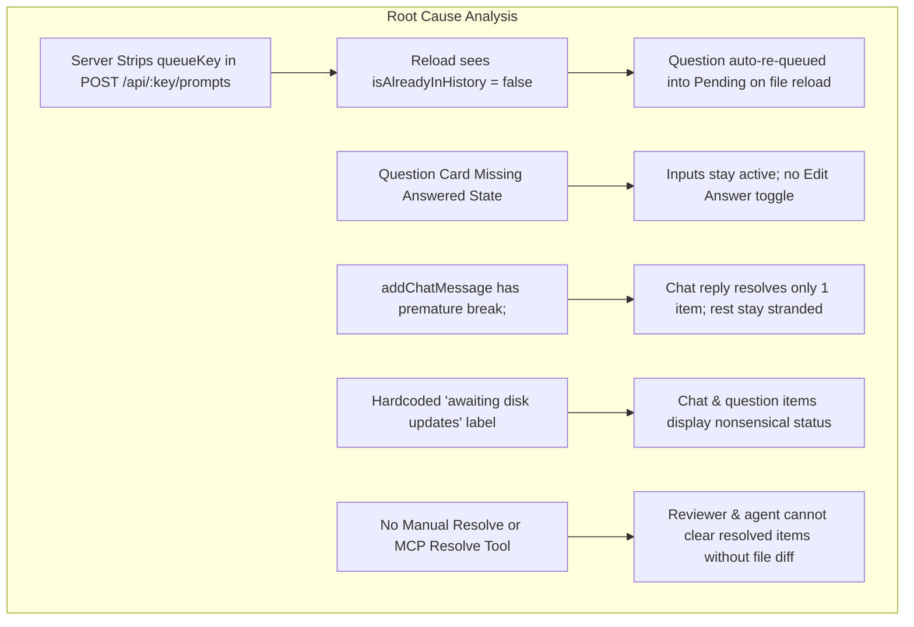
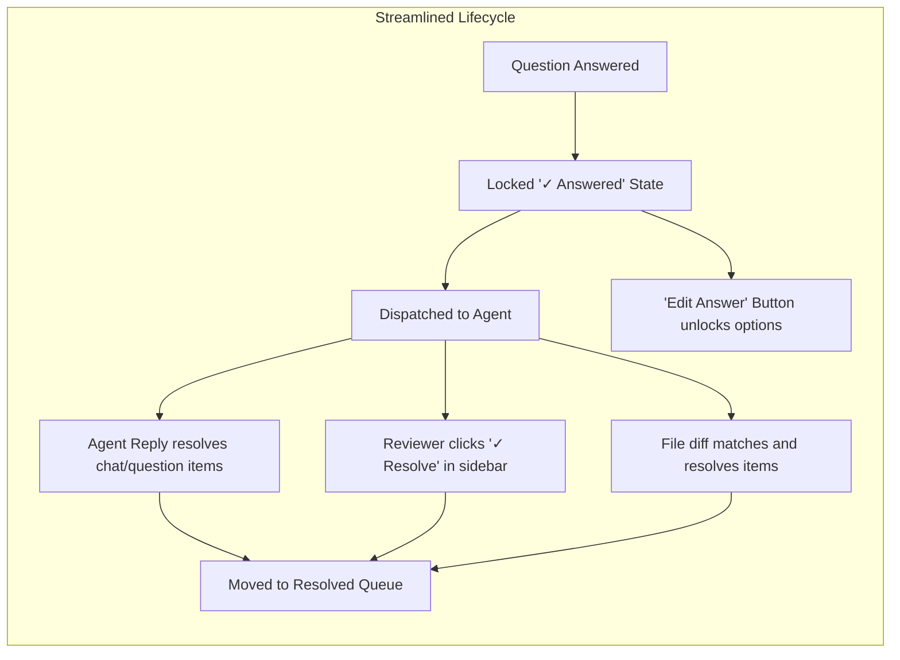

# Plan: Answered Question Locking, Edit State, and Prompt Lifecycle Resolution

## 1. Executive Summary & Root Cause

During live review sessions, users experienced two major points of friction:
1. **Answered questions remained editable and re-appeared in Pending**: After selecting choices and submitting them to the agent, the question cards remained fully interactive. Furthermore, whenever the agent modified a document on disk and triggered a hot-reload, the submitted questions were automatically re-queued back into the "Staged Feedback / Pending" area.
2. **Submitted items remained stuck in Pending ("Dispatched to agent - awaiting disk updates")**: Even after an agent answered a question in chat or in a separate knowledge base note, items remained in `submitted` status under the Pending tab. The agent falsely claimed ZenSpec requires a disk diff specifically at the exact commented line.

### Detailed Root Cause Breakdown

1. **Stripped `queueKey` in [`src/server.ts`](file:///Users/egand/Developer/projects/zenspec/src/server.ts#L663)**:
   When `POST /api/:key/prompts` receives prompts, it creates a new `PromptItem` but omits `queueKey`. In [`src/client/app.ts`](file:///Users/egand/Developer/projects/zenspec/src/client/app.ts#L412), `isAlreadyInHistory` checks `submittedPrompts.some(p => p.queueKey === 'question-' + questionId)`. Because `queueKey` was stripped, this check always failed after submission, causing `setupQuestionListeners` to re-queue the default answer into Pending on every file reload.
2. **Missing "Answered" State & "Edit Answer" Button in UI**:
   In [`src/sourcemap.ts`](file:///Users/egand/Developer/projects/zenspec/src/sourcemap.ts#L407) and [`src/client/app.ts`](file:///Users/egand/Developer/projects/zenspec/src/client/app.ts#L307), options remain enabled and interactive indefinitely. There is no locked state showing the selected answer with an "✏️ Edit Answer" button to allow intentional re-editing.
3. **Premature `break;` in [`src/session-store.ts`](file:///Users/egand/Developer/projects/zenspec/src/session-store.ts#L565)**:
   In `addChatMessage`, when an agent replies, a loop iterates through submitted prompts and breaks after the very first item. If the reviewer submitted multiple questions, only one is resolved while the rest remain stranded.
4. **Misleading "Awaiting Disk Updates" Label**:
   In [`src/client/app.ts`](file:///Users/egand/Developer/projects/zenspec/src/client/app.ts#L1682), every submitted item displays `Dispatched to agent - awaiting disk updates`, even for general chat questions that require a conversational answer rather than a code patch.
5. **Missing Reviewer Dismissal & Missing Agent Resolve Tool**:
   There is no UI button for the reviewer to manually mark an in-progress item as resolved, and no MCP tool (`zen_resolve_prompt`) or CLI command for an agent to resolve items programmatically.

---

## 2. Proposed Architecture & Implementation

### 2.1 Preserve `queueKey` Across Server and Store (`src/server.ts`)
- In `src/server.ts` inside `POST /api/:key/prompts`, include `queueKey: p.queueKey` when constructing `PromptItem`.
- In `src/session-store.ts`, ensure `queueKey` is preserved across serialization and session updates.
- This guarantees `isAlreadyInHistory` returns `true` for previously submitted or resolved questions, preventing duplicate auto-queuing on hot-reloads.

### 2.2 Question "Answered" State & "✏️ Edit Answer" Action (`src/client/app.ts`, `src/client/styles.css`)
- When a question has an answer recorded (in `queuedPrompts`, `submittedPrompts`, or `resolvedPrompts`):
  - Mark the container with class `zen-question-answered`.
  - Disable input elements (radio, checkbox, custom text input) to prevent accidental clicks.
  - Display an "Answered" header badge showing `✓ Answered` alongside an `✏️ Edit Answer` button.
  - When the user clicks `✏️ Edit Answer`:
    - Remove the `zen-question-answered` class and enable inputs.
    - Change button text to `Lock Answer` or allow clicking options to re-queue.
    - If the user selects a new answer, it replaces the existing queue entry or queues a new modification prompt.

### 2.3 Comprehensive Chat Resolution (`src/session-store.ts`)
- In `addChatMessage`, when `sender === ActorRole.Agent`:
  - Resolve all submitted prompts that are awaiting agent response (both `PromptTag.Chat` and `PromptTag.Question`), rather than terminating on the first item with `break;`.
  - Attach the `agentReply` to each resolved item's resolution metadata.

### 2.4 Context-Aware In-Progress Status Badges (`src/client/app.ts`)
- In `renderQueue()`:
  - If `item.tag === PromptTag.Chat`: Display `⚡ Dispatched to agent - awaiting reply`.
  - If `item.tag === PromptTag.Question`: Display `⚡ Answer submitted - awaiting agent confirmation`.
  - If `item.tag === PromptTag.Annotation` or `PromptTag.Suggestion`: Display `⚡ Dispatched to agent - awaiting document update`.

### 2.5 Manual "✓ Resolve" Action in In-Progress Feedback Stream (`src/client/app.ts`, `src/server.ts`)
- Add a `✓ Resolve` button on each card in the "In Progress with Agent" section.
- When clicked:
  - Calls `POST /api/:key/prompts/resolve` with `{ promptId: p.id }`.
  - Immediately transitions the card to the **✅ Resolved** tab in the browser.
  - Reviewers can dismiss or resolve any item whenever the agent satisfies the question verbally or in a separate file.

### 2.6 Agent MCP Tool: `zen_resolve_prompt` (`src/mcp.ts`, `src/cli.ts`)
- Expose `zen_resolve_prompt` in `src/mcp.ts`:
  - Arguments: `filePath: string`, `promptId?: string`, `queueKey?: string`, `reply?: string`.
  - Allows agents to mark prompts resolved directly without needing an artificial diff in the reviewed document.
- Add CLI command: `zenspec resolve <filePath> --prompt-id <id> --reply <message>`.

---

## 3. Interactive Review Questions

> [!QUESTION] 1. "Answered" Question Visual Presentation
> How should answered decision cards appear in the document canvas?
> - [x] **(Recommended) Compact Locked State with '✏️ Edit Answer' button**: Selected card is highlighted with a green checkmark badge, inputs are disabled, and an '✏️ Edit Answer' button sits neatly in the callout header to toggle editing.
> - [ ] **Dimmed Inactive State**: Dim the entire question card and require clicking an 'Unlock' button before seeing options.
> - [ ] **Always Editable (No Lock)**: Keep options always clickable without an edit toggle, only fixing the duplicate queueing bug.

> [!QUESTION] 2. Agent Chat Resolution Scope
> When an agent sends a chat message via `zen_reply` or `--agent-reply`, which submitted items should be automatically marked resolved?
> - [x] **(Recommended) Resolve All Submitted Chat and Question Items**: All pending questions and chat prompts submitted before the reply are marked resolved with the agent's message attached. Line annotations and suggestions remain in progress awaiting document diffs.
> - [ ] **Resolve All Submitted Items Unconditionally**: Mark every submitted item (chat, questions, annotations, suggestions) as resolved upon agent reply.
> - [ ] **Strict Manual Resolution Only**: Chat messages never resolve prompts automatically; only disk diffs or explicit resolve actions resolve them.

> [!QUESTION] 3. Reviewer Manual Resolution UI
> Where should the manual '✓ Resolve' action be located for in-progress items?
> - [x] **(Recommended) Direct '✓ Resolve' button on each in-progress card**: Gives instant one-click control to move any card to the Resolved tab.
> - [ ] **Context menu / overflow dropdown**: Keep card clean and hide resolution behind a '...' button.

---

## 4. Test Battery & Verification Plan

1. **Server & Store Unit Tests (`tests/server.test.ts`, `tests/session-store.test.ts`)**:
   - Verify `queueKey` is preserved when submitting prompts via `POST /api/:key/prompts`.
   - Verify `addChatMessage` resolves multiple submitted chat and question items without premature exit.
   - Verify `resolvePrompt` endpoint transitions prompt status to `resolved`.
2. **MCP Tool Tests (`tests/mcp.test.ts`)**:
   - Verify `zen_resolve_prompt` successfully resolves a prompt by `promptId` and attaches reply metadata.
3. **Browser E2E Tests (`tests/e2e-browser.test.ts`)**:
   - Verify answered question cards render with locked inputs and display an `✏️ Edit Answer` button.
   - Verify clicking `✏️ Edit Answer` re-enables inputs and allows modifying the selection.
   - Verify reloading document does NOT re-queue answered questions into Pending.
   - Verify clicking `✓ Resolve` on an in-progress card moves it to the Resolved tab.
