# Implementation Plan - Accurate Jump & Highlight Engine & Comprehensive Test Battery

## 1. Executive Summary

This plan addresses the root causes behind broken **"📍 Jump & Highlight"** actions in ZenSpec without polluting Markdown files with artificial tags or metadata. By repairing the AST source-mapping pipeline in `sourcemap.ts`, tracking document coordinate shifts in `session-store.ts`, and upgrading the browser client's range highlighting in `app.ts`, we ensure surgical, deterministic jump-to-modification behavior across all document structures.

In addition, we replace the existing superficial tests with a rigorous battery of unit, integration, and real browser E2E tests covering nested blocks, line coordinate shifts, multi-diff document updates, and viewport scroll assertions.

---

## 2. Problem Statement & Root Cause Analysis

### 2.1 AST Token Desynchronization in `sourcemap.ts`

- **Mechanism**: `extractBlockLineRanges()` computes a flat queue of line ranges for top-level tokens. When Marked parses container blocks (such as `> [!QUESTION]` or `> [!NOTE]` callouts and loose lists), the custom renderer calls `this.parser.parse(token.tokens)`.
- **Bug**: Child paragraphs inside the blockquote trigger the custom `renderer.paragraph()` hook, which calls `nextRange()`. This steals ranges intended for subsequent top-level blocks.
- **Impact**: Any Markdown document containing a callout, blockquote, or nested list immediately corrupts the `data-line-start` and `data-line-end` attributes of every subsequent heading, paragraph, and code block in the file.

### 2.2 Coordinate Drift & Blind Fallback in `session-store.ts`

- **Mechanism**: `computeLineDiff()` outputs line numbers corresponding to the _new_ file. However, `resolvePromptsWithDiff()` compares the user prompt's `target.startLine` (recorded against the _old_ file) directly against the new diff coordinates without adjusting for lines inserted or deleted earlier in the document.
- **Bug**: When no direct overlap is found, it unconditionally defaults to `diffs[0]`.
- **Impact**: If an agent updates the frontmatter (e.g. status or timestamp) and also adds 20 lines in Section 3, `diffs[0]` is line 2 (frontmatter). The prompt is marked resolved with Lines 2-2, and "Jump & Highlight" sends the reviewer to the top of the document.

### 2.3 Single-Element Query & Disappearing Highlights in `app.ts`

- **Mechanism**: `jumpAndHighlightLine(startLine, endLine)` uses `container.querySelector('[data-line-start="${targetLine}"]')`.
- **Bug**: If a change spans multiple elements (e.g., a heading, two paragraphs, and a code block), only the first node is selected. Furthermore, if `targetLine` falls inside a block rather than at its exact start, the query returns null and falls back to a single best-guess node.

---

## 3. Architecture & Technical Solution

```mermaid
flowchart TD
  subgraph Sourcemap["Part 1: Deterministic AST Sourcemap (sourcemap.ts)"]
    A[Markdown Source Text] --> B[Token Lexer with Line Offsets]
    B --> C[Top-Level & Child Block Line Boundaries]
    C --> D[Accurate data-line-start & data-line-end DOM Attributes]
  end

  subgraph SessionStore["Part 2: Coordinate Shift Tracking (session-store.ts)"]
    E[Old vs New File Diff] --> F[Diff Ranges in New Coordinates]
    G[Old Prompt Line Coordinates] --> H[Coordinate Mapping via Preceding Diffs]
    F & H --> I[Accurate Diff Match: Section 3, not Frontmatter]
    I --> J[Prompt Resolution with True Line Range]
  end

  subgraph ClientApp["Part 3: Multi-Element Viewport Highlight (app.ts)"]
    K[Jump & Highlight Click] --> L[Query All DOM Nodes Overlapping Range]
    L --> M[Scroll First Node to Viewport Center]
    M --> N[Apply Glowing Pulse to All Overlapping Blocks]
  end

  Sourcemap --> ClientApp
  SessionStore --> ClientApp
```



### 3.1 Deterministic Source Line Tagging (`src/sourcemap.ts`)

1. **Scoped Token Traversal**: Instead of a global unmanaged queue consumed indiscriminately by both parent and child renderers, calculate line ranges deterministically from token character offsets and raw line counts.
2. **Context-Aware Renderer Hooks**: Ensure that child blocks within container blocks (callouts, blockquotes, lists) either compute their relative line offset from the parent container or inherit container bounds without stealing the outer block queue.
3. **Table & Codeblock Precision**: Ensure fenced code blocks and Markdown tables preserve exact line counting, including trailing blank lines and delimiters.

### 3.2 Coordinate Shift Tracking & Smart Diff Matching (`src/session-store.ts`)

1. **Coordinate Projection**:
   - Given a list of line diffs between `oldContent` and `newContent`, map any line number $L_{old}$ to its projected position $L_{new}$ by accumulating length deltas:
     $$\Delta L = \sum_{d \in \text{preceding diffs}} (\text{newLines}_d - \text{oldLines}_d)$$
2. **True Proximity Matching**:
   - Compare the prompt's projected target line against `diffs`.
   - Match the diff with the highest proximity or overlap to the projected target.
   - If the prompt was a global question/chat (no target line), match the primary content diff (ignoring frontmatter-only or whitespace-only diffs) rather than naive `diffs[0]`.
3. **Resolution Metadata**:
   - Store exact `startLine`, `endLine`, and `diffSummary` corresponding to the matched modification.

### 3.3 Multi-Element Viewport Highlighting (`src/client/app.ts`)

1. **Range Overlap Selection**:
   - Query all elements with `[data-line-start]` in the document view:
     ```ts
     const matchingEls = allNodes.filter((el) => {
       const s = parseInt(el.getAttribute("data-line-start") || "0", 10);
       const e = parseInt(el.getAttribute("data-line-end") || String(s), 10);
       return s <= targetEnd && e >= targetStart;
     });
     ```
2. **Synchronized Smooth Scroll**:
   - Scroll the first matching element into viewport center with `{ behavior: "smooth", block: "center" }`.
3. **Persistent Multi-Block Pulse**:
   - Apply `.zen-resolved-highlight` to all elements in `matchingEls`.
   - Ensure clear visual focus without abruptly removing the indicator while the user is reading.

### 3.4 Mermaid Label Defensive Preprocessor (`src/sourcemap.ts`)

1. **Label Sanitization**:
   - Inside `renderer.code` for language `mermaid`, pre-process the raw diagram text before rendering into `<pre class="mermaid">`.
   - Detect quoted node and subgraph labels that start with CommonMark list markers (e.g., `["1. `, `["2. `, `["- `, `["* `).
   - Automatically rewrite leading list patterns to safe non-list labels:
     - `["1. ` $\to$ `["(1) ` or `["Part 1: `
     - `["- ` $\to$ `["• `
   - This guarantees that even if an agent or user authors Mermaid diagrams with numbered steps or bullets in labels, Mermaid's markdown parser will never choke with `unsupported markdown: list`.

---

## 4. Comprehensive Test Battery

To ensure robustness and eliminate "dumb" or superficial tests, we implement a dedicated, multi-layer test suite:

### 4.1 Unit & AST Line Integrity Battery (`tests/sourcemap.test.ts`)

- **Nested Blockquote & Callout Follow-Through**:
  - Test documents with a `> [!QUESTION]` callout followed by 3 sections of headings, paragraphs, and code blocks.
  - Assert that lines for every subsequent block match 100% of their actual line numbers in the raw Markdown source.
- **Complex Loose Lists**:
  - Test lists with multi-line paragraphs and task checkboxes followed by sub-headings. Verify no off-by-one or queue-stealing errors.
- **Document with Frontmatter, Math, and Diagrams**:
  - Full-featured plan with YAML frontmatter, display KaTeX math, Mermaid diagrams, and GFM admonitions. Verify all injected `data-line-start` attributes match line-by-line ground truth.

### 4.2 Diff Engine & Coordinate Mapping Battery (`tests/session-store.test.ts`)

- **Preceding Insertion Drift**:
  - Insert 40 lines at line 10. Prompt target at line 50.
  - Verify `resolvePromptsWithDiff` correctly maps prompt to line 90 instead of diff at line 10.
- **Preceding Deletion Drift**:
  - Delete 20 lines at line 10. Prompt target at line 50.
  - Verify prompt maps to line 30.
- **Multi-Diff Document with Frontmatter**:
  - Change line 3 (frontmatter title) AND change lines 45-60 (Section 2 details).
  - Submit prompt on Section 2.
  - Assert resolved prompt links to lines 45-60, NOT line 3 (`diffs[0]`).
- **Global / Chat Prompt Resolution**:
  - Submit prompt with no `target`. Agent edits body section.
  - Assert resolved prompt matches body edit rather than frontmatter timestamp.

### 4.3 End-to-End Real Browser Automation (`tests/e2e-browser.test.ts`)

- **Full Human-Agent Feedback Loop**:
  1. Reviewer annotates lines 35-40 in Section 2 with feedback: "Add error handling details".
  2. Test simulates agent editing `plan.md` on disk: adding frontmatter version bump AND adding 15 lines of error handling in Section 2.
  3. Server broadcasts hot-reload and prompt resolution via SSE.
  4. Browser automatically updates document view in memory without page refresh.
  5. Reviewer switches to Resolved tab and clicks **"📍 Jump & Highlight"**.
  6. Assert:
     - Viewport scroll position brings Section 2 into view.
     - All modified elements in the range receive `.zen-resolved-highlight`.
     - Toast displays exact line range `35-55`.

---

## 5. File Modifications Checklist

| File                                                                                                        | Proposed Modifications                                                                                                                                      |
| ----------------------------------------------------------------------------------------------------------- | ----------------------------------------------------------------------------------------------------------------------------------------------------------- |
| [`src/sourcemap.ts`](file:///Users/egand/Developer/projects/zenspec/src/sourcemap.ts)                       | Fix token line range queue so inner blocks in callouts/blockquotes/lists do not corrupt top-level line mapping; add defensive Mermaid list label sanitizer. |
| [`src/session-store.ts`](file:///Users/egand/Developer/projects/zenspec/src/session-store.ts)               | Implement coordinate projection across diffs and intelligent content-diff matching in `resolvePromptsWithDiff`.                                             |
| [`src/client/app.ts`](file:///Users/egand/Developer/projects/zenspec/src/client/app.ts)                     | Upgrade `jumpAndHighlightLine` to query all overlapping DOM blocks and highlight the complete modified span.                                                |
| [`tests/sourcemap.test.ts`](file:///Users/egand/Developer/projects/zenspec/tests/sourcemap.test.ts)         | Add comprehensive AST ground-truth tests for nested callouts, loose lists, and trailing sections.                                                           |
| [`tests/session-store.test.ts`](file:///Users/egand/Developer/projects/zenspec/tests/session-store.test.ts) | Add tests for coordinate drift, multi-diff disambiguation, and prompt resolution.                                                                           |
| [`tests/e2e-browser.test.ts`](file:///Users/egand/Developer/projects/zenspec/tests/e2e-browser.test.ts)     | Add full end-to-end real browser test with disk edit, line shift, hot-reload, and multi-block viewport jump assertion.                                      |

---

## 6. Verification & Quality Gates

Run full test suite and quality gates:

```bash
npm run check
```

This executes:

1. `npm run typecheck` (`tsc --noEmit`)
2. `npm run lint` (`eslint src tests scripts`)
3. `npm run format:check` (`prettier --check .`)
4. `npm run build` (`scripts/build.ts`)
5. `npm test` (`vitest run` including unit, integration, and Puppeteer browser E2E)
