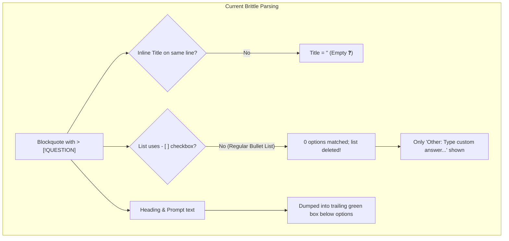
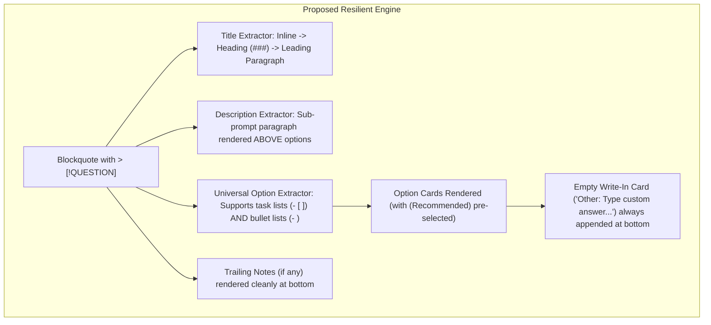

# Plan: Resilient Question Callouts and Custom Write-in Options

## 1. Executive Summary & Root Cause

When agents generate architectural specifications with interactive questions, they frequently use standard Markdown headings and bullet lists:

```markdown
> [!QUESTION]
>
> ### 2. Workforce Simulation Depth
>
> Which labor model fits your vision best?
>
> - **Macro Allocation (Frostpunk Style)**: Buildings have worker headcounts...
> - **Micro Pawn Agents (RimWorld / Timberborn Style)**: Individual physical characters...
> - **Hybrid Layered Approach**: Macro allocation for building operations...
```

In ZenSpec's current renderer ([`src/sourcemap.ts`](file:///Users/egand/Developer/projects/zenspec/src/sourcemap.ts)), this caused a severe visual failure:

1. **Empty Title (`❓ `)**: The parser only extracted titles on the same line as `> [!QUESTION] <title>`. A newline left the title empty.
2. **Missing Proposals**: The option extractor strictly required task checkboxes (`- [ ]`). Standard bullet lists (`- `) matched zero options and were stripped from the document.
3. **Inverted Layout**: The heading and prompt description were pushed into a trailing container below the options, leaving only an isolated "Other: Type custom answer..." box.





---

## 2. Architectural Design & Changes

### 2.1 Parser Upgrades (`src/sourcemap.ts`)

- **Flexible Title Extraction**:
  1. Check for inline title after `[!QUESTION]`.
  2. If empty, check for first heading (`<h[1-6]>`) within the blockquote.
  3. If no heading, check for leading paragraph (`<p>`).
- **Description & Sub-Prompt Detection**:
  - If a paragraph exists between the title and the option list (e.g. "Which labor model fits your vision best?"), extract it as `questionDesc` and render it directly below the title.
- **Universal Option List Matching**:
  - Parse any `<li>` inside the question block:
    - Task items: check if `checked=""`.
    - Standard bullets: convert to option cards.
    - If an option starts with `**(Recommended)**` or `(Recommended)`, mark as default selected.
- **Always-Present Empty Write-In Option**:
  - Append the custom write-in option card (`Other: Type custom answer...`) at the bottom of the proposal list for both single-select and multi-select questions.
- **Clean Residual Content**:
  - Only genuine trailing notes or rationale text remaining after extracting title, description, and options are placed into `.zen-question-decision`.

### 2.2 Client UI & Interaction (`src/client/app.ts` & `src/client/styles.css`)

- **Visual Radio & Selection Synchronization (Fixing Desync Bug)**:
  - When the user focuses or types into `.zen-option-custom-input`:
    - Immediately check the custom card's radio button: `customRadio.checked = true`.
    - In single-select mode, uncheck and unselect all other proposal cards (`card.classList.remove("selected")` and `radio.checked = false`).
    - This eliminates the visual desync where a recommended option appears checked while a custom text answer is active.
  - When the custom input is completely cleared (`val === ""`), remove `.selected` from the custom card and remove the question's item from the pending queue.
- **Pre-Selected Default Synchronization with Pending Queue**:
  - On initial document render (`setupQuestionListeners`), scan all question callouts for pre-selected options (`.zen-option-card.selected` from `- [x]` or recommended defaults).
  - Automatically queue these default answers into the Pending review queue:
    - The reviewer immediately sees the pending answers in the right sidebar (e.g. `Answer to "1. Primary Grid Topology": Hexagonal Grid`).
    - The reviewer has full transparency into what default selections will be communicated to the agent.
    - If the reviewer switches to another option or custom write-in, it seamlessly replaces the pending prompt in place.
- **Typography & Styling**:
  - Style `.zen-question-desc` with clear typography and subtle margin beneath the callout title.
  - Clean focus ring and border highlight for `.zen-option-custom`.

### 2.3 Restructuring the Feedback Lifecycle: "In Progress with Agent" Stream

- **The Core Problem**: Currently, clicking "Send to Agent" clears `queuedPrompts` (`[]`), but `resolvedPrompts` only contains items with `status: "resolved"`. Items awaiting agent modification have `status: "submitted"`. They were discarded by the client and rendered nowhere, causing the reviewer's feedback to vanish into a black hole with zero feedback.
- **The Solution: 3-State Visual Lifecycle**:
  1. **Staged Drafts (`queuedPrompts`)**:
     - Local pending drafts before clicking Send.
     - Editable, removable, with Directive action chips and Send button.
  2. **In Progress with Agent (`submittedPrompts`)**:
     - When "Send to Agent" is clicked, items transition immediately to the **⚡ In Progress with Agent (<count>)** section.
     - Each card displays:
       - Category badge: `[QUESTION]`, `[SUGGESTION]`, `[NOTE]`.
       - Target line coordinate or question title.
       - The exact answer or text sent to the agent.
       - An active pulsing status badge: `⚡ Dispatched to Agent - Awaiting modifications on disk...`
       - Shows the timestamp of when it was sent.
     - Reviewers always know exactly what the agent is currently working on.
  3. **Resolved Items (`resolvedPrompts`)**:
     - Once the agent updates the document on disk or sends a reply, items smoothly transition from "In Progress" to the **✅ Resolved** tab with `📍 Jump & Highlight` pointers and diff previews.

### 2.4 Skill & Invariant Enforcement

- Update [`skills/zenspec/SKILL.md`](file:///Users/egand/Developer/projects/zenspec/skills/zenspec/SKILL.md) and [`~/.gemini/config/skills/zen/SKILL.md`](file:///Users/egand/.gemini/config/skills/zen/SKILL.md) to document canonical question formatting:
  - Single Choice: `> [!QUESTION] Title` with `- [x] **(Recommended)** Option 1` and `- [ ] Option 2`.
  - Multi-Select: `> [!QUESTION:MULTI] Title`.
  - Rating: `> [!QUESTION:RATING] Title`.

---

## 3. Review Decisions & Resolved Feedback

> [!QUESTION] 1. Custom Write-In Card Positioning
> Where should the empty custom write-in option ("Other: Type custom answer...") be positioned relative to proposals?
>
> - [x] **(Recommended) Always at the bottom of the proposal list**: Presents the curated options first, with the custom field as an alternative escape hatch.
> - [ ] **At the top above proposals**: Gives immediate prominence to write-in responses.

> [!QUESTION] 2. Default Selection & Pending Queue Synchronization
> How should pre-selected recommended options be made visible to the agent and reviewer?
>
> - [x] **(Agreed Solution) Pre-select and auto-queue in Pending**: On document load, pre-selected options are rendered checked AND registered in the Pending queue. The reviewer sees them in the sidebar and can override them, and typing in custom write-in immediately unchecks other options.
> - [ ] **Manual confirmation only**: Require the user to click every option before adding to Pending.

> [!QUESTION] 3. Feedback Queue Restructuring
> How should submitted items awaiting agent resolution be displayed to the reviewer?
>
> - [x] **(Recommended) Dedicated 'In Progress with Agent' live feed in the Active panel**: When clicking Send, staged items immediately transition to an active feed with pulsating amber badges. Items remain visible with their timestamp and question title until the agent resolves them, then move to Resolved.
> - [ ] **Add a third separate tab (Pending / In Progress / Resolved)**: Separate into 3 distinct tabs with tab switching.

---

## 4. Test Battery & Verification Plan

1. **AST Sourcemap Unit Tests (`tests/sourcemap.test.ts`)**:
   - Question callout with inline title and task checkboxes.
   - Question callout with standalone `> [!QUESTION]`, `### Heading`, and description paragraph.
   - Question callout with standard bullet list (`- **Option**`).
   - Pre-selection of `**(Recommended)**` options.
   - Presence of `.zen-option-custom` write-in option card at the bottom.

2. **Real Browser End-to-End Tests (`tests/e2e-browser.test.ts`)**:
   - Render document with multiline question containing proposals and custom write-in card.
   - Interactively select a proposed option card and verify queue update.
   - Interactively type a custom response into the write-in card and verify it queues to the agent and unchecks proposal radios.
   - Click "Send to Agent" and verify items transition immediately to the "⚡ In Progress with Agent" feed (NOT disappearing into an empty void).
   - Simulate agent disk modification and verify items transition from "In Progress" to "Resolved" with jump pointers.

3. **CI Gate**:
   - `npm run check` (typecheck, lint, format check, build, full test suite).
