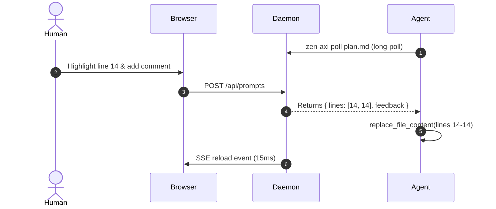

# Zen AXI Architecture Plan

A minimalist, high-performance review system for Markdown documentation.

## 1. System Overview

The system consists of three primary components:

1. **CLI Layer (`zen-axi`)**: A zero-dependency, single-bundle ESM executable (`dist/cli.mjs`) compiled via `esbuild`. It handles command routing (`open`, `poll`, `reply`, `end`, `export`, `status`, `stop`), auto-spawns the detached background server daemon on demand if not already running, and resolves deterministic 16-character SHA-256 session keys from canonical file paths.
2. **Server Daemon (`ZenServer`)**: A lightweight local HTTP/SSE daemon listening on `127.0.0.1:4388`. It manages session states in memory with JSON snapshot backup (`~/.zen-axi/state.json`), watches documents via `chokidar` for live reload, and manages event-driven long-polling waiters.
3. **Browser Client (`src/client`)**: Zero-build in-memory Markdown compiler (Marked + KaTeX + Mermaid). Computes source-line AST tags (`data-line-start`, `data-line-end`) dynamically without intermediate disk writes, and manages radio question cards and floating annotation popups.

## 2. Interactive Questions & State Persistence

> [!QUESTION] Which default storage backend should we use for long-term state persistence?
>
> - [ ] In-Memory Map with JSON snapshot fallback
> - [x] SQLite embedded database
> - [ ] Redis cache
>
> **Decision**: Adopt embedded SQLite (`node:sqlite` in Node 22+) for queryable ADR decision logs and multi-turn review diffs.

### Why State Persistence is Needed

State management decouples human review from agent execution, enabling asynchronous review loops:

1. **Asynchronous Feedback Delivery**: When an agent goes idle or sleeps, user annotations remain safely queued in state until the next agent poll (`zen-axi poll`).
2. **Crash & Restart Durability**: If the local server daemon restarts or the computer sleeps, active sessions and queued annotations are restored from `~/.zen-axi/state.json`.
3. **Session & Multi-Tab Synchronization**: Chat history and active feedback survive browser tab reloads and can be viewed across multiple devices/tabs via the same session key.

### Storage Option Tradeoffs & Token Efficiency

| Storage Option                            | Complexity & Dependencies                                                    | Multi-Reviewer & Query Power                                                               | Token Overhead                                                                             | Best Fit                                                    |
| :---------------------------------------- | :--------------------------------------------------------------------------- | :----------------------------------------------------------------------------------------- | :----------------------------------------------------------------------------------------- | :---------------------------------------------------------- |
| **In-Memory + JSON Snapshot** _(Default)_ | **Zero dependencies** (pure Node core `fs` + `Map`). Instant startup (<5ms). | Fast key-value lookups; linear scan for historical diff queries.                           | **Optimal (0 token overhead)**: Serializes only active prompts directly to poll responses. | **Single-user & small team local reviews**                  |
| **Embedded SQLite**                       | Low (single `.sqlite` file, zero external daemons, `node:sqlite`).           | **High**: SQL indices for historical ADR queries, multi-turn diffs, and concurrent writes. | **Optimal (0 token overhead)**: Filtered indexed queries retrieve exact line deltas.       | **Large repos with long-term ADR & multi-reviewer history** |
| **Redis Cache**                           | High (requires external daemon, network binding, port config).               | High pub/sub capabilities, but over-engineered for local CLI usage.                        | **Higher latency**: Network serialization overhead without local file affinity.            | **Distributed multi-machine cloud teams**                   |

### Token Efficiency Impact of Storage

- **Zero Serialization Bloat**: Storage backends only persist structured delta records (`{ startLine, endLine, text }`), preventing LLMs from having to re-read or resend historical logs.
- **Selective ADR Materialization**: Decision records are written to disk as concise Markdown (`docs/adr/*.md`) only upon explicit session end, consuming zero conversational tokens during the live review loop.

## 3. Mathematical Foundations

The token reduction efficiency factor $\eta$ measures the percentage of LLM context window tokens saved when using pure Markdown documentation over verbose HTML artifacts:

$$\eta = 1 - \frac{\text{Tokens}_{\text{Markdown}}}{\text{Tokens}_{\text{HTML}}} \approx 0.72$$

### Derivation & Token Economics

In traditional rich artifact interfaces, LLM agents generate and re-send heavy HTML/CSS boilerplate (Tailwind classes, inline SVGs, script tags, DOM containers):

- **Average HTML Artifact Size**: $\sim 3,200\text{ tokens}$ ($\sim 12.8\text{ KB}$)
- **Equivalent Markdown Document**: $\sim 900\text{ tokens}$ ($\sim 3.6\text{ KB}$)

$$\eta = 1 - \frac{900}{3200} = 1 - 0.281 = 0.719 \approx 72\%$$

### Comparative Benchmark

| Metric                         | HTML Artifacts (Lavish/Raw)               | Markdown Plans (Zen AXI)              | Improvement                  |
| :----------------------------- | :---------------------------------------- | :------------------------------------ | :--------------------------- |
| **Initial Plan Creation**      | $\sim 3,500\text{ tokens}$                | $\sim 850\text{ tokens}$              | **$75.7\%$ savings**         |
| **Feedback Round-Trip (Edit)** | $\sim 3,800\text{ tokens}$ (full rewrite) | $\sim 120\text{ tokens}$ (line patch) | **$96.8\%$ savings**         |
| **Git Repository Storage**     | Intermediate `.html` files                | Clean `docs/plans/*.md`               | **Zero git clutter**         |
| **Rendering Latency**          | $80-250\text{ ms}$                        | $< 15\text{ ms}$ (in-memory AST)      | **$10\times\text{ faster}$** |

### Surgical Line-Anchored Updates

Because Zen AXI tags every DOM node with `data-line-start` and `data-line-end`, agent edits only modify the targeted slice of lines via `replace_file_content` rather than rewriting the entire document, compounding token savings across multi-round review loops.
