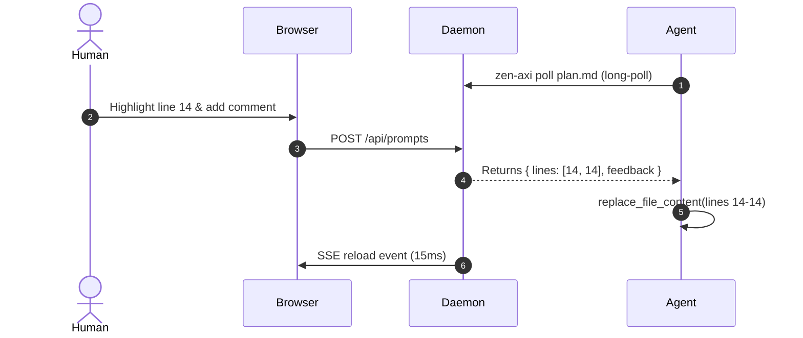

# Zen AXI Architecture Plan

A minimalist, high-performance review system for Markdown documentation.

## 1. System Overview

The system consists of three primary components:

1. **CLI Layer**: Single-bundle executable communicating with the local daemon.
2. **Server Daemon**: Fast, in-memory state manager with long-polling coordination.
3. **Browser Client**: In-memory Markdown compiler with source line anchoring.

## 2. Interactive Questions

> [!QUESTION] Which default storage backend should we use for long-term state persistence?
>
> - [x] In-Memory Map with JSON snapshot fallback
> - [ ] SQLite embedded database
> - [ ] Redis cache

## 3. Mathematical Foundations

The token reduction efficiency factor $\eta$ is defined as:
$$\eta = 1 - \frac{\text{Tokens}_{\text{Markdown}}}{\text{Tokens}_{\text{HTML}}} \approx 0.72$$
