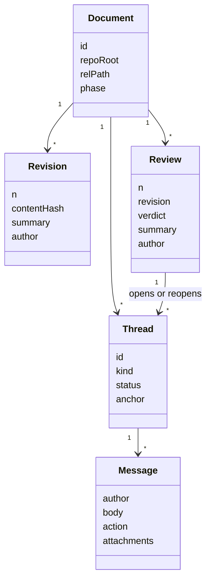
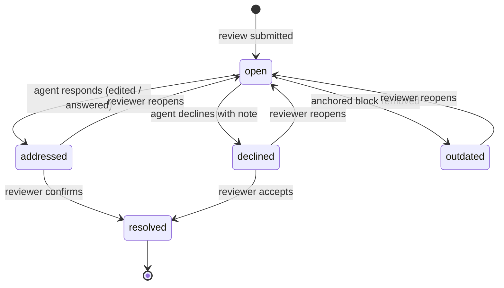
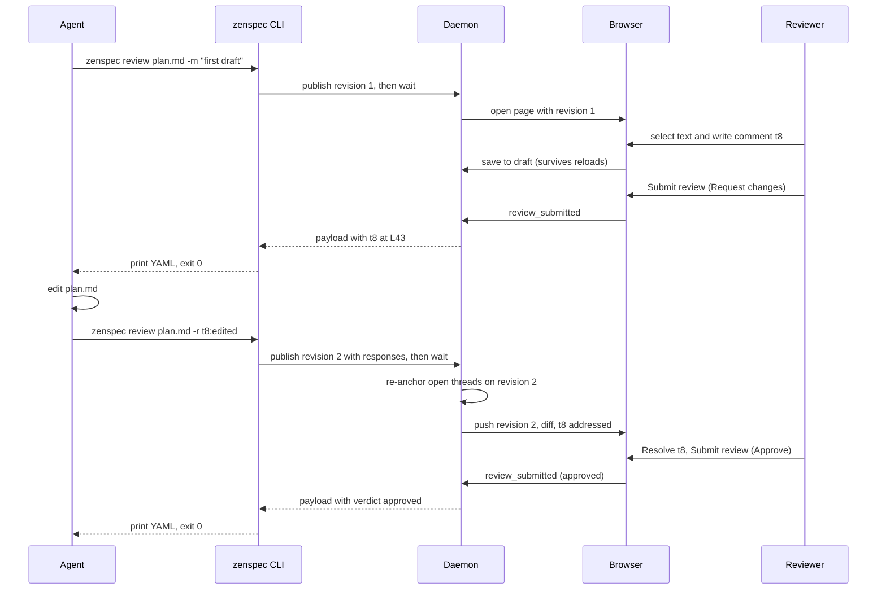
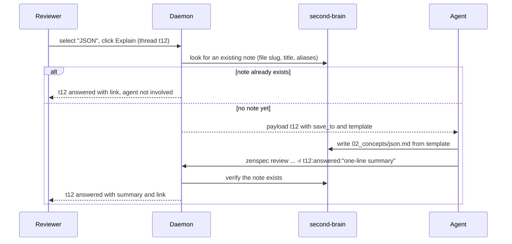
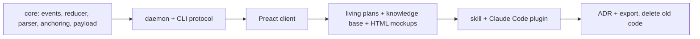

# Plan: ZenSpec v2 Architecture

## 1. Summary

The ZenSpec idea holds up: an agent writes Markdown, a human reviews it in a rich UI, and structured feedback goes back to the agent. The current implementation has hit a ceiling because of four structural choices:

1. **Feedback is anchored to line numbers**, and "resolved" is **inferred from diffs** (`resolvePromptsWithDiff` counts anything within 5 lines, or "the biggest diff", as resolved). Lines drift after every edit, so the lifecycle bugs never stop.
2. **The only agent channel is a destructive long-poll.** `takeQueuedPrompts` empties the queue, a second poller gets `superseded`, and the CLI exits 0, which a harness can read as approval.
3. **State has many writers.** The daemon, CLI, and MCP each own a `SessionStore` writing to `~/.zenspec`. This was reproduced while opening this very plan: a stale daemon answered `Session not found` and the CLI still exited 0, then `zenspec stop` left a zombie process.
4. **There is no document model.** Questions are parsed by regex over *rendered HTML* (with position-based IDs `q-<line>`), the ADR generator uses a different regex over Markdown, and the client interprets the content a third way.

This plan replaces the whole codebase with a model borrowed from **pull-request review**: threads, revisions, and verdicts, stored as an append-only event log. It keeps **agent cost** as a hard, tested constraint. Everything described here **ships as a single release**.

### Decisions so far

| Topic | Decision |
|---|---|
| MCP | Removed; CLI only |
| Document writes | ZenSpec never writes to the reviewed document |
| Review log location | `~/.zenspec` only, never inside the repo (§5) |
| Verdict signaling | Exit 0 for any delivered review; verdict on the first payload line (§8.3) |
| Claude Code gate scope | Per repo (§14) |
| Client framework | Preact + signals (§15) |
| Release strategy | Everything at once, no staged versions (§17) |
| Living plans | In scope (§10) |
| Explanations | Written as notes in the external knowledge base (`second-brain`), linked from the thread (§11) |
| HTML mockups | Kept (§12) |
| Images | Pasted or dropped into any comment; the agent opens them only when needed (§9.2) |

## 2. Goals & Non-Goals

**Goals**

- The agent writes **only plain Markdown** and reads **only compact changes**. Rendering, anchoring, diffing, and tracking resolution are all done by zenspec's own code, at zero token cost.
- **One CLI call per review round.**
- Resolution is **declared** (agent) and **confirmed** (reviewer), never guessed.
- Works with **any harness** through the CLI, with optional per-harness adapters (Claude Code first).
- The plan stays useful **after approval**, tracking implementation progress (living plans).
- The document stays free of explanations the reviewer asked for (§11).

**Non-Goals**

- **No MCP server.** The CLI is cheaper (no tool schemas sitting in context) and works everywhere.
- **ZenSpec never writes to the reviewed document.** Harnesses such as Claude Code refuse edits to files changed since the agent's last read, and in every harness the agent's picture of the file would drift out of date. Suggestions are delivered as exact `old`/`new` strings for the agent to apply.
- **No HTML authoring for ordinary docs.** Rich content comes from compact Markdown extensions. HTML is only for visual mockups (§12).

## 3. Cost Model

Output tokens (what the agent writes) are the most expensive; standing context (what is loaded on every turn) is the most insidious. The design budgets each explicitly.

| Cost | Today | New design |
|---|---|---|
| Writing the doc | Markdown | Same Markdown. Block IDs are derived, so the agent writes no extra syntax |
| Standing context | 8 MCP tools with long "MANDATORY GATE" descriptions, ~6 KB `SKILL.md` | No tools. A skill of about 40 lines. `zenspec help` is read only when needed |
| Tool calls per round | `poll` + `reply` + `progress` (+ re-polls) | **1** (`zenspec review`) |
| Reading feedback | Possibly stale line numbers, so the agent often re-reads the file | Quote + current lines + exact `old`/`new`, so it edits directly |
| Waiting | Free in the background; ambiguous exits cause retries | Free; nothing ambiguous is ever returned |
| Approval gate | Instructions repeated in tool descriptions | Enforced by a hook where the harness supports it (0 tokens) |
| Implementation progress | `zenspec progress` calls | Ticking a checkbox in the plan with one small edit (§10) |

**Budget invariants (enforced by tests, see §16):**

- Payload overhead of ≤ 80 tokens per review plus ≤ 25 tokens per thread, excluding human-written text and quotes.
- Quotes truncated to 120 characters.
- Images are never inlined in the payload: only a path plus dimensions (about 15 tokens). They're stored downscaled to at most 1568 px on the long edge, so opening one costs at most about 1.6k tokens for Claude models.
- Exactly **one** CLI invocation per review round in the scripted-agent test.
- The payload never contains the document, history, or resolved threads.

## 4. Domain Model



- **Revision**: an explicit snapshot published by the agent (not every file save).
- **Review**: one submission by the reviewer against a revision, containing a verdict (`approved`, `changes_requested`, or `comment`), a summary, and new or reopened threads.
- **Thread**: the one and only unit of feedback. Kinds:
  - `comment`: an anchored remark or question.
  - `suggestion`: an anchored exact text replacement (`old` → `new`).
  - `decision`: the reviewer's answer to a `[!QUESTION]` block, anchored to that block.
  - `explain`: a request to explain a term or concept. It's answered with a note in the knowledge base, linked from the thread, and never in the document (§11).
  - `general`: an unanchored comment (replaces the old chat).
- **Document phase**: `drafting → in_review → approved → implementing → done` (see §10 for the last two).

### Thread lifecycle



If the agent publishes a revision without responding to an open thread, the thread stays `open`. The UI shows a **hint** ("likely addressed: revision 3 changed this region"), computed from anchor overlap. The hint never changes the thread's status.

## 5. Storage: Append-Only Event Log

The daemon is the **only writer**. The CLI and the browser talk to it over HTTP. All state lives under `~/.zenspec` and **never inside the repo**.

```text
~/.zenspec/
  daemon.json                         # { pid, port, version }
  config.yaml                         # user settings, incl. knowledge base (§11)
  repos/<repo-id>/
    docs/<doc-id>/
      events.jsonl                    # append-only, one event per line
      revisions/<n>.md                # revision snapshots
      draft.json                      # reviewer's unsubmitted pending review
      attachments/<sha256>.png        # pasted images, content-addressed
```

- `<repo-id>` is the repo folder name plus a short hash of the git top-level path (e.g. `zenspec-3f9a1c`). Outside git, the document's directory is used instead.
- `<doc-id>` is a slug of the repo-relative path.

This fixes v1's collisions across repos and the dependency on the daemon's `process.cwd()`.

| Event | Payload |
|---|---|
| `revision_published` | `n`, `contentHash`, `summary`, `author` |
| `review_submitted` | `n`, `revision`, `verdict`, `summary`, `author`, `opened[]` (full threads with anchors), `reopened[]` (`id`, `body`), `resolved[]` (ids) |
| `agent_responded` | `revision`, `responses[]` (`thread`, `action`, `note`) |
| `step_checked` | `step`, `checked` (living plans, §10) |
| `plan_drifted` | `revision`, `diffSummary` (content changed after approval, §10) |
| `session_closed` | `by`, `reason` |

Every event carries `ts` and `author`. Current state is computed from the log by a pure function in `core/`, **shared by the daemon and the browser**, so both sides are always derived from the same rules. Keeping drafts on the server fixes the bug where a hot reload erased unsent annotations.

Since logs never enter the repo, a future team mode would need an explicit `zenspec export-log` / `import-log` (§18). The `author` field keeps that door open at no cost.

## 6. Document Parsing: One AST, Many Consumers

Replace the regex-over-HTML parser with **unified/remark** (`remark-parse`, `remark-gfm`, `remark-math`, `remark-frontmatter`). A single `parseDocument(md)` returns:

- `blocks[]`: each with a derived `blockId`, a type, and source `start`/`end` lines (from mdast positions).
- `questions[]`: each with a `questionId`, mode (`single`, `multi`, or `rating`), options, and a recommended option.
- `steps[]`: GFM task-list items (`- [ ]`) with derived step IDs (§10).

The renderer, the anchoring engine, the ADR generator, and the payload formatter all consume this one structure.

**Block IDs** are derived as `heading-path slug + block ordinal within the section` (for example `caching/p3`). **Question IDs** are derived from the question title slug (`which-database-should-we-use`), with an optional explicit override, `> [!QUESTION] Which database? {#db-engine}`. The agent never has to write IDs.

The existing `[!QUESTION]`, `[!QUESTION:MULTI]`, and `[!QUESTION:RATING]` syntax is kept unchanged, because agents already know it. New interactive components use fenced blocks with a YAML body (e.g. ` ```zen-matrix `), which costs far fewer tokens than HTML.

## 7. Anchoring

An **anchor** is how a thread remembers *what text it is about*, so it keeps pointing at the right place after the agent edits the document. Line numbers alone can't do this: insert 10 lines at the top and every comment below points at the wrong line.

When the reviewer creates a thread, the browser captures a **selector** (the W3C Web Annotation approach): the quoted text, a little context around it, and the block it lives in.

```yaml
anchor:
  rev: 1
  block: caching/p1
  quote: "cache invalidation via TTL only"
  prefix: "we rely on "     # ~32 chars before
  suffix: " for sessions"   # ~32 chars after
  lines: [43, 43]           # at rev 1
```

When a new revision is published, each open thread is **re-anchored** by these steps, stopping at the first that succeeds:

1. Exact `prefix+quote+suffix` match.
2. Exact `quote` match inside the same `block`.
3. Unique exact `quote` match anywhere.
4. Fuzzy match of the quote (whitespace-normalized, similarity ≥ 0.8) inside the block, then anywhere.
5. The block still exists but the quote is gone: the thread is attached to the **whole block**, and the UI shows the original quote next to the block's new text.
6. The block is gone: the thread becomes **`outdated`** and is shown with its original quote, the way GitHub shows outdated comments.

The resolved positions are cached per revision. Line numbers in agent payloads are always computed against the **current file on disk** at delivery time.

### 7.1 Worked example: one comment across three revisions

**Revision 1**: the agent writes the plan. The *Caching* section contains:

```markdown
40  ## Caching
41
42  Sessions are cached in Redis and we rely on
43  cache invalidation via TTL only for sessions.
```

The reviewer selects `cache invalidation via TTL only`, writes *"What about write-through for the session table?"* (thread `t8`), and submits the review with **Request changes**.

**Revision 2**: the agent adds a 10-line *Security* section near the top, but hasn't reached `t8` yet, so it doesn't respond to it. Everything below shifts down by 10 lines.

**Revision 3**: the agent rewrites the sentence to `cache invalidation via TTL plus write-through for sessions` and responds `-r t8:edited`.

| Revision | What happened to the text | Re-anchoring step that matched | Where `t8` points | `t8` status |
|---|---|---|---|---|
| 1 | Reviewer comments | (created) | L43 | `open` |
| 2 | 10 lines inserted above | Step 1 (exact match with context) | **L53** (moved automatically) | `open`; the UI shows no "likely addressed" hint because the region didn't change |
| 3 | Sentence rewritten | Step 4 (fuzzy match, similarity 0.83) | L53, new wording highlighted | `addressed` (the agent said `edited`) |
| — | Reviewer clicks **Resolve** | — | — | `resolved` |

With today's code, `t8` would have been marked resolved at revision 2, because a change happened within 5 lines of it (in fact, any change anywhere counts for untargeted items).

### 7.2 Communication flow



The agent only ever talks to the CLI, and the CLI only ever talks to the daemon. The agent is *blocked, at zero token cost*, between each `review` call and the payload that comes back.

## 8. Agent Protocol (CLI)

### 8.1 One command for the loop

```bash
zenspec review <file> [-m "<summary>"] [-r <thread>:<action>[:<note>]]... [--responses-file <path|->]
```

Every call does the following in order:

1. Starts the daemon if needed.
2. If the file content differs from the last revision, publishes a new revision (with `-m` as its summary).
3. Records the responses (`action` is one of `edited`, `answered`, `declined`). Long notes can come from a YAML file or stdin via `--responses-file -`.
4. Opens the browser the first time.
5. **Blocks until the first review submitted after this call**, then prints the payload and exits 0.

There is no queue to drain and no supersede: **every** waiting process receives the same review, so multiple agents or subagents are safe.

### 8.2 Other commands

| Command | Purpose |
|---|---|
| `zenspec gate [<file>]` | Exit 0 if approved, 1 otherwise (used by hooks and CI) |
| `zenspec close <file>` | Close the session (agent side) |
| `zenspec status` | List open reviews in the current repo |
| `zenspec adr <file>` | Generate an ADR from decision threads |
| `zenspec export <file>` | Standalone HTML export |
| `zenspec daemon stop` | Stop the daemon (it actually exits) |
| `zenspec help [cmd]` | Full reference, read only when needed |

Removed: `mcp`, `poll`, `approve` (approval is a human action only), `reply`, `progress` (replaced by checkboxes, §10), and `--share` (until it can be rebuilt with real authentication).

### 8.3 Payload

YAML on stdout. Every item is a thread, and decisions are threads too:

```yaml
verdict: changes_requested
review: 3
revision: 2
summary: "Mostly good; caching section needs work."
threads:
  - id: t8
    kind: comment
    at: L42-44
    quote: "cache invalidation via TTL only"
    body: "What about write-through for the session table?"
  - id: t9
    kind: suggestion
    at: L60
    old: "Use Redis"
    new: "Use Redis (managed, not self-hosted)"
  - id: t10
    kind: decision
    question: db-engine
    at: L71-78
    choice: PostgreSQL
    body: "but keep SQLite for tests"
  - id: t12
    kind: explain
    term: JSON
    body: "What is this?"
    save_to: ~/Developer/projects/second-brain/content/02_concepts/json.md
    template: ~/Developer/projects/second-brain/content/05_templates/concept_template.md
  - id: t4
    kind: comment
    reopened: true
    at: L12
    body: "Still unclear who owns the migration."
  - id: t11
    kind: general
    body: "Can you add a rollback section?"
  - id: t13
    kind: comment
    at: L88
    quote: "Pending tab"
    body: "The agent panel overlaps the list, see screenshot."
    images:
      - ~/.zenspec/repos/zenspec-3f9a1c/docs/plan/attachments/9c1e….png  # 1320x2248
next: zenspec review docs/plans/x.md -r <id>:<edited|answered|declined>[:note]
```

- Decision threads may carry `choice: [auth, billing]` (multi), `choice: 4` (rating), or `choice: other` with the write-in text in `body`.
- A thread that is only a question is answered with `-r t8:answered:"<answer>"`; the answer appears in the thread in the UI.
- An `explain` thread is answered by writing the note at `save_to` and then responding `-r t12:answered:"<one-line summary>"` (§11).
- Payload text is plain UTF-8, never HTML-escaped (today's payloads leak entities like `it&#39;s`).
- `images` are absolute paths the agent opens with its own file or image tool **only if the text isn't enough** (the skill says so). Harnesses without image support still get the text.
- `verdict` is always the first line. The process exits 0 for any delivered review. Non-zero exits are reserved for real errors (daemon unreachable, unknown session) and interrupts, and they print the error on stderr.
- On `verdict: approved`, the payload lists any threads still open (if the reviewer approved with comments), and `next:` points to the living-plan workflow (§10).

### 8.4 Harness timeouts

A blocking call can exceed a harness's command timeout. `--wait <duration>` returns `verdict: pending` along with `next: <same command>` when it expires. The skill tells the agent to prefer background execution (for example Claude Code's background Bash, which wakes the agent when the command exits). Re-running `review` with no changes and no responses simply resumes waiting.

## 9. Reviewer Experience

- **Pending review**: comments, suggestions, explain requests, and answers accumulate in a server-side draft and survive reloads, restarts, and agent edits.
- **Submit review** with a verdict: *Approve*, *Request changes*, or *Comment*.
- **Revision timeline**: diffs between any two revisions, plus "changes since my last review".
- **Live preview**: edits on disk still hot-reload, marked as *unpublished changes* until the agent publishes them as a revision. Threads are anchored to revisions, never to intermediate saves.
- **Thread panel**: each thread shows the agent's response, a diff hint, and **Resolve** / **Reopen** buttons.
- **Selection toolbar**: *Comment*, *Suggest edit*, *Explain*.

### 9.1 Answers to questions

Today's Pending tab shows answers you never gave: the recommended option is queued automatically, and after a reload, answers to questions that no longer exist reappear, because question IDs are line-based (`q-404`). The new rules:

- The recommended option is **highlighted, never auto-selected or queued**. A `decision` thread exists only after you click an option.
- Question IDs are content-derived (§6), so they survive edits and reloads.
- Draft items are **re-anchored like threads** (§7) whenever the document changes. Items whose question or text disappeared are marked *orphaned* with their original quote, rather than silently re-created.
- **Submit review** with unanswered questions asks you once: *leave them unanswered* or *accept the recommended option for N questions*.
- The agent's messages never overlap the thread list. They live inside their threads, and the pending list has its own scroll area.

### 9.2 Images

Some feedback is easier to show than to describe (a rendering bug, a sketch, a reference UI).

- **Paste** (`Cmd+V`) or **drag and drop** an image into any comment, suggestion note, reply, or general thread. Thumbnails appear in the draft and in the thread, and clicking one opens it in the existing lightbox.
- The browser sends the image to the daemon, which **downscales** it to at most 1568 px on the long edge and stores it content-addressed under `attachments/` (§5), never in the repo.
- The agent gets the file path and dimensions in the payload (§8.3) and opens the image only when the text isn't enough. That keeps a round with a screenshot at about 15 extra tokens unless the image is actually needed.
- **Inbox**: one tab lists all open reviews across repos served by the daemon.

## 10. Living Plans

After approval, the plan stays live and becomes the **implementation tracker**.

**Steps** are the GFM task-list items already in the plan (for example a `## Implementation Steps` section with `- [ ] Build event log`). The parser derives step IDs (§6).

**Progress costs almost nothing.** When the agent finishes a step, it ticks the checkbox itself (`- [ ]` → `- [x]`) with one small edit to its own file. There's no extra CLI call, and the committed plan shows what was done. Because the agent makes the edit, its view of the file stays accurate.

**The daemon classifies each change** to an approved plan:

- **Only checkboxes changed** → `step_checked` events. This is progress, not a new revision.
- **Content changed** → a `plan_drifted` event. The UI shows a banner with the diff ("the plan changed after approval"). The reviewer can accept the change or request changes. The gate stays open so implementation isn't interrupted, but drift is always visible.

**The reviewer can comment during implementation** (e.g. "careful with step 3"). Those threads reach the agent in one of two ways:

- **Claude Code**: a `PostToolUse` hook runs `zenspec inbox --pending` (which outputs nothing when there's nothing new) and passes any new threads back to the model as additional context. It costs 0 tokens when there are no comments. The exact hook output format is to be confirmed against the Claude Code hook docs during the build.
- **Other harnesses**: they are delivered at the final review.

**Final sign-off**: when all steps are checked, the agent runs `zenspec review <file> -m "implemented"`. The reviewer sees the plan with its progress, drift banners, and implementation comments, then gives a verdict. *Approve* moves the document to `done`; *Request changes* sends the agent back to work with threads.

**UI**: a progress bar, per-step timestamps, the current step highlighted, and a phase badge (`in review`, `implementing`, `done`).

## 11. Explanations Without Noise

**Problem.** The reviewer often needs concepts explained ("what is JSON?", "what is Preact?"). If the agent writes those explanations into the plan, the document fills up with content meant for one reader at one moment, which is noise for the spec itself and for anyone reading it later.

**Decision.** Explanations go into the reviewer's **personal knowledge base**, in this case the `second-brain` Quartz site (`~/Developer/projects/second-brain`). They are stored as concept notes that follow its existing template. The plan stays clean, the thread links to the note, and each concept is explained **once, ever**.

### 11.1 Configuration

The knowledge base is configured, not hardcoded, so it works with any folder of Markdown notes:

```yaml
# ~/.zenspec/config.yaml
knowledgeBase:
  root: ~/Developer/projects/second-brain
  notesDir: content/02_concepts
  template: content/05_templates/concept_template.md
  link: http://localhost:8080/02_concepts/{slug}   # `just serve`; or https://second-brain.pages.dev/02_concepts/{slug}
```

Without a `knowledgeBase` configured, explain threads are answered inside the thread only.

### 11.2 Flow



- **Existing notes cost nothing.** Before an explain thread ever reaches the agent, the daemon searches the knowledge base (file slug, frontmatter `title` and `aliases`). If it finds a note, it answers the thread itself with the link, without involving the agent.
- **New notes** are written by the agent into the knowledge base, not the plan, following the template (intuition first; sections such as math or the mindmap are optional when they don't apply). Output-token cost is the same as writing the explanation anywhere else, and it's only paid once per concept.
- **The thread** shows the one-line summary and an **Open note** link.
- **Tooltips in future plans**: the daemon indexes note titles, aliases, and `summary` frontmatter. The first occurrence of a known term in any document gets a subtle underline with the summary on hover and a link to the note. **Got it** turns off highlighting for that term.
- **The agent never commits** in the knowledge base; you sync it yourself as usual (`just sync`). The Claude Code gate hook (§14) is scoped to the reviewed repo, so writing into `second-brain` is never blocked.

## 12. HTML Mockups

**What this is.** Besides Markdown, zenspec can review a **`.html` file written by the agent**, typically a visual mockup of a screen (a dashboard layout, a form, a settings page) where Markdown can't show what the UI will look like. Zenspec displays the page inside a **sandboxed iframe** (an embedded page that can't touch the rest of the app), and the reviewer clicks any element (a button, a table cell, a heading) to comment on it.

**How it fits the new model.**

- Anchor = `{ cssPath, tag, textQuote }`. Re-anchoring tries the text quote among elements of the same tag, then the CSS path. If both fail, the thread becomes `outdated`.
- Only `comment`, `explain`, and `general` threads apply: `suggestion` needs source text, and HTML clicks don't map to exact source strings.
- Revisions, verdicts, and payloads work exactly as for Markdown.
- **Cost warning in the skill**: HTML costs several times more tokens than Markdown, so agents should use it only when a *visual* mockup is really needed.

**Decision: kept.** It's the only way to review UI proposals visually, and it reuses the whole thread and revision model.

## 13. Daemon

- **Single global daemon** on one port, with state stored per repo under `~/.zenspec/repos/` (§5). The CLI finds the port from `~/.zenspec/daemon.json` (`{pid, port, version}`); a version mismatch triggers a restart. That fixes the stale-daemon problem reproduced in §1.
- `daemon stop` really exits the process (no zombies).
- Shuts down after 30 minutes with no waiters and no open browser tabs.
- SSE per document (no broadcast across the workspace), carrying events. The browser applies the same shared state function.
- Binds to `127.0.0.1` only; CORS limited to the daemon's own origin.

## 14. Harness Integration

**Layer 1: Skill (all harnesses).** About 40 lines covering when to use zenspec, the `zenspec review` loop, the response syntax, the gate rule, the checkbox progress rule, and "prefer background execution". Everything else lives in `zenspec help`.

**Layer 2: Claude Code plugin.**

- Bundles the skill.
- A `PreToolUse` hook on `Edit|Write|MultiEdit` runs `zenspec gate --repo`. **Scoped per repo**: while any review in the repo is open and unapproved, it blocks edits outside `docs/plans/**` with a message telling the agent to wait for approval.
- A `PostToolUse` hook delivers implementation-time comments (§10).
- The skill tells Claude Code to use background Bash for `zenspec review`.

**Layer 3: Antigravity.** Needs investigation into its extension points (rules, workflows, any hook-like mechanism). Baseline support is the skill plus the CLI.

## 15. Client: Preact + Signals

### What is Preact?

**Preact** is a tiny (about 4 KB) alternative to **React** with the **same API**: function components, JSX, and hooks (`useState`, `useEffect`). If you know React, you already know Preact. The code looks identical; only the import changes (`preact` instead of `react`).

**Signals** (`@preact/signals`) are reactive values, the same idea as **Angular signals** or **Vue's `ref()`**. You read `count.value`, and when you change it, **only the parts of the UI that read it re-render**, rather than whole component trees.

```tsx
import { signal } from "@preact/signals";

const openThreads = signal(0);

function ThreadBadge() {
  return <span class="badge">{openThreads.value} open</span>;
}

// anywhere: openThreads.value = 3  → only the badge updates
```

| | Angular | React | Vue | Preact + signals |
|---|---|---|---|---|
| Size | Large | ~45 KB | ~35 KB | **~5 KB** |
| Templates | HTML templates | JSX | SFC templates | JSX |
| Reactivity | Signals / zone | Re-render + hooks | `ref()` / reactive | **Signals** + hooks |
| Build tooling | CLI required | Usually Vite | Usually Vite | **esbuild alone** (already used) |

**Why it fits here:** the UI is a single page driven by a stream of events. A small set of signals derived from the shared state function (§5), such as threads, revisions, draft, and phase, maps directly onto that. It replaces the current 2,500 lines of manual DOM updates with components that re-render themselves, which removes the whole class of "UI out of sync with state" bugs.

### Hot reload: nothing is regenerated

When the agent edits the `.md` file, **nobody regenerates anything**: the agent doesn't produce HTML, and there's no build step.

1. The daemon's file watcher notices the change and pushes the new Markdown to the browser over SSE.
2. The browser parses it into blocks (with the same `parseDocument` from `core/`, §6), each keyed by its `blockId`.
3. Preact compares the new blocks to the old ones and **re-renders only the blocks whose content changed**. Unchanged paragraphs, KaTeX formulas, and Mermaid diagrams stay in place untouched, and the scroll position is preserved naturally, because the page is never rebuilt.

Today the whole document is re-rendered on every save, including every Mermaid diagram, and the scroll position has to be restored by hand. With keyed blocks, a one-line edit touches one block.

## 16. Code Structure & Testing

The current code is replaced, not refactored. Worth keeping: `styles.css` and the visual design, the Mermaid/KaTeX configuration, and the lightbox logic. The existing tests are integration-heavy, rely on `setTimeout` delays, and are tied to replaced behavior; **they are not ported**.

```text
src/
  core/        # pure, no I/O: events, state reducer, parseDocument, anchoring, payload formatter
  daemon/      # http routes, sse, file watching, event-log storage, knowledge-base index
  cli/         # commands; talks to daemon over HTTP only
  client/      # Preact + signals; reuses core/ reducer and parser types
skills/zenspec/SKILL.md
plugins/claude-code/  # hooks + plugin manifest
```

The dependency rule is `core` ← `daemon`, `cli`, `client`. `core` imports nothing that does I/O.

| Suite | What it proves |
|---|---|
| `core` unit tests | Payload text never HTML-escaped; reducer transitions (the full §4 state machine), each re-anchoring strategy (including the §7.1 example as a fixture), block, question, and step ID stability across edits, and change classification (progress vs drift) |
| Protocol contract tests | `zenspec review` against a real daemon: revision publishing, broadcast to several waiters, `--wait` timeout, responses, non-zero exit on errors |
| **Cost budget tests** | Payload token estimates for fixture reviews stay within the §3 budgets; a scripted agent completes a round in exactly one CLI call |
| Browser E2E (few) | Draft survives reload and document edits; the recommended option is never queued automatically; orphaned draft items; pasting an image into a comment; submit review; resolve/reopen; revision diff; living-plan progress |

## 17. Build Order (single release)

Everything ships together. The order below exists only because each part depends on the previous ones.



Old state in `~/.zenspec/sessions` and `state.json` is not migrated; it's deleted on first start of the new daemon.

## 18. Future (Out of Scope)

- **Team mode**: `export-log` / `import-log` of review logs, reviewer identity, authenticated sharing.
- **Other artifacts**: code diffs and test reports reviewed through the same thread, revision, and verdict model.
