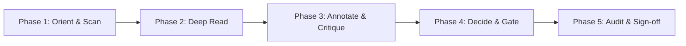
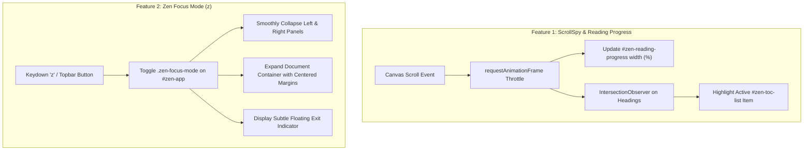

# ZenSpec Reviewer Experience Evaluation & Feature Proposals

> Comprehensive evaluation of ZenSpec from the perspective of human technical reviewers, architects, and engineering leads, with prioritized feature recommendations to elevate document review workflows.

---

## 1. Executive Summary

ZenSpec is currently one of the most token-efficient Agent Experience Interfaces (AXI) available for reviewing AI-generated Markdown plans, technical RFCs, and HTML prototypes. Its core strengths include:

- **Sub-15ms In-Memory Rendering**: Instant KaTeX, Mermaid diagrams with pan/zoom lightbox, and AST source-line mapping (`data-line-start`, `data-line-end`).
- **Surgical Line Feedback**: Delivers precise `{ startLine, endLine, feedback }` payloads for one-call agent updates via `replace_file_content`.
- **Gated Plan Approval**: Enforces explicit human approval before any implementation code or scaffolding can begin.
- **Resolved Modification Tracking**: Seamless "📍 Jump & Highlight" pulse animations to inspect resolved modifications.

However, when approached purely from the viewpoint of a **human reviewer** who spends hours reading, verifying, cross-referencing, and approving complex specifications, several high-leverage UX opportunities emerge. This document evaluates these opportunities across the reviewer's cognitive lifecycle:



---

## 2. Reviewer Journey Analysis & Capability Matrix

| Reviewer Phase             | Current ZenSpec Capabilities                                                              | Reviewer Friction Points                                                                                             | High-Leverage Opportunities                                                                                   |
| :------------------------- | :---------------------------------------------------------------------------------------- | :------------------------------------------------------------------------------------------------------------------- | :------------------------------------------------------------------------------------------------------------ |
| **1. Orient & Scan**       | Workspace file explorer, basic Table of Contents (TOC) with estimated read time.          | No indication of where the reader is while scrolling; no full-text search across large plans.                        | Active ScrollSpy TOC, document reading progress bar, in-page command palette search.                          |
| **2. Deep Read**           | Dark/light theme, clean typography, code block copy, responsive diagrams.                 | Dual sidebars can feel cluttered on smaller screens or laptop viewports; long tables and formulas can overwhelm.     | Zen Focus Mode (one-key sidebar collapse), collapsible document sections, table sorting/filtering.            |
| **3. Annotate & Critique** | Text highlight comment modal, suggested edit replacement input, margin pins, quick chips. | Feedback is isolated in the right queue; no side-by-side visual diff preview for suggestions; no inline thread view. | Inline diff preview for suggestions, gutter comment cards, multi-reaction quick flags (Risky, Blocked, Good). |
| **4. Decide & Gate**       | `[!QUESTION]` single/multi/rating cards, "✅ Approve Plan" button, agent live status.     | All-or-nothing approval gate; no structured multi-criteria decision matrix; no formal "Request Changes" state.       | Three-tier review verdict (Approve / Request Changes / Discuss), Decision Matrix callouts (`[!MATRIX]`).      |
| **5. Audit & Sign-off**    | Raw HTML export (`zenspec export`), MADR generator (`zenspec adr`), session timestamps.   | Export does not include the reviewer feedback trail or decision log; no permanent sign-off in frontmatter.           | Frontmatter sign-off stamp, annotated review packet export (PDF/HTML), revision comparison slider.            |

---

## 3. High-Leverage Feature Proposals

### Feature 1: Dynamic ScrollSpy & Reading Progress Bar

- **Reviewer Problem**: In lengthy 500+ line technical RFCs, reviewers lose spatial orientation when scrolling. The Table of Contents (TOC) shows sections, but clicking is one-way.
- **Proposed Solution**:
  - Implement an `IntersectionObserver` in `app.ts` that tracks the currently visible heading and dynamically highlights the corresponding entry in the Left Sidebar Outline.
  - Add a subtle 2px reading progress bar at the very top of the canvas indicating document read percentage (0% to 100%).
- **Trade-offs & Complexity**: Low complexity (<100 LOC), zero external dependencies, pure browser DOM APIs, instant cognitive benefit.

### Feature 2: Zen Focus Mode (`z` shortcut)

- **Reviewer Problem**: Architects reviewing detailed specifications need maximum canvas width and zero visual distractions, especially when inspecting wide tables, math proofs, or Mermaid architecture diagrams.
- **Proposed Solution**:
  - A keyboard shortcut (`z`) and topbar button that collapses both the Left Sidebar (Files/TOC) and Right Sidebar (Feedback/Chat) simultaneously.
  - Expands the main document canvas to a comfortable, centered reading measure with auto-hiding floating action pills.
  - **Input Safety Guard**: When typing in any `<input>`, `<textarea>`, or editable field (e.g., commenting, suggesting edits, writing in the composer), pressing `z` types the character `z` normally. The global listener explicitly checks `document.activeElement` and ignores all text input elements so reviewer typing is never interrupted.
- **Trade-offs & Complexity**: Very low complexity, highly appreciated by deep readers.

### Feature 3: Visual Split/Unified Diff Preview in Suggestion Modal

- **Reviewer Problem**: When using "✏️ Suggest Edit", the reviewer writes proposed replacement text in a textarea, but cannot visually preview word-level or line-level additions/deletions before queuing.
- **Proposed Solution**:
  - Real-time word-level diff preview inside the modal (red strikethrough for deleted text, green highlight for added text).
  - Reviewer immediately spots accidental deletions or formatting typos before the payload is delivered to the agent.
- **Trade-offs & Complexity**: Low-to-medium complexity. A micro LCS or word-diff utility (<80 LOC) in `sourcemap.ts` or client script provides instant feedback without external libraries.

### Feature 4: Three-Tier Review Verdicts (Approve / Request Changes / Discuss)

- **Reviewer Problem**: The current topbar only has "✅ Approve Plan". If the plan has fatal architectural flaws or missing edge cases, the reviewer must submit comments, but there is no formal "⚠️ Request Changes" or "Needs Revision" status signal to the agent.
- **Proposed Solution**:
  - Replace or augment the single button with a review verdict dropdown:
    1. **✅ Approve Plan**: Authorizes agent to proceed with code implementation (`status: "approved"`).
    2. **⚠️ Request Changes**: Explicitly rejects the plan, instructing the agent to revise the design based on queued critique.
    3. **💬 Submit Feedback**: General clarification questions without a binding go/no-go verdict.
- **Trade-offs & Complexity**: High value for formal team workflows; requires minor extension to `PollResponse` and CLI status reporting.

### Feature 5: Multi-Criteria Architecture Decision Matrix (`> [!DECISION-MATRIX]`)

- **Reviewer Problem**: Architects frequently choose between 2-4 competing designs (e.g. SQLite vs PostgreSQL vs DuckDB) across multiple vectors (Latency, Memory, Scaling, Dev Effort). Standard question cards only provide single-choice radio buttons.
- **Proposed Solution**:
  - Introduce a new callout syntax in `sourcemap.ts`:
    ```markdown
    > [!DECISION-MATRIX] Database Engine Selection
    > | Option | Latency | Storage Efficiency | Complexity |
    > | SQLite | 5/5 | 5/5 | 1/5 |
    > | PostgreSQL | 4/5 | 4/5 | 4/5 |
    ```
  - Renders as an interactive comparison matrix where reviewers can click to select the winning candidate or adjust criteria weights.
- **Trade-offs & Complexity**: Medium complexity; significantly improves architectural RFC review quality.

### Feature 6: Cumulative Revision History & Baseline Diff Slider

- **Reviewer Problem**: When an agent addresses feedback in multiple iterations, the reviewer wants to see: "What changed between v1 (initial proposal) and v3 (current proposal)?" Currently, ghost diffs only highlight changes from the single most recent disk save.
- **Proposed Solution**:
  - Snapshot file content revisions in `SessionStore` upon each agent poll / disk write.
  - **Left Sidebar Placement**: Place the revision slider and version timeline in the Left Panel (as a dedicated tab or dropdown alongside Documents and Outline) rather than crowding the topbar.
  - Highlights cumulative additions and deletions across the entire review session directly on the canvas.
- **Trade-offs & Complexity**: Medium complexity; keeps topbar minimalist while giving clear multi-turn diff inspection in the left navigation panel.

### Feature 7: Permanent Review Sign-off Stamp in Document Frontmatter

- **Reviewer Problem**: Once a plan is approved, approval metadata lives in daemon memory or `state.json`, but when committed to Git, there is no permanent sign-off record in the Markdown file itself.
- **Proposed Solution**:
  - When clicking "Approve Plan", offer to automatically append or update YAML frontmatter:
    ```yaml
    approval:
      reviewer: "human"
      timestamp: "2026-09-14T07:45:00Z"
      status: "approved"
    ```
  - Keeps git history fully auditable without requiring external databases.
- **Trade-offs & Complexity**: Low complexity; clean integration with `replace_file_content` or CLI `approve` command.

---

## 4. Interactive Reviewer Priorities & Feedback

> [!QUESTION:MULTI] Which navigation and reading features would most improve your review flow?
>
> - [x] **(Selected & Agreed) Dynamic ScrollSpy & Reading Progress Bar**: Real-time position tracking in TOC.
> - [x] **(Selected & Agreed) Zen Focus Mode**: Single-key (`z`) collapse of both sidebars for distraction-free reading.
> - [ ] In-Page Full-Text Search Command Palette (`/` or `Cmd+K`).
> - [ ] Collapsible Document Sections (`##`, `###` folding).
>
> **Decision**: Prioritize **Dynamic ScrollSpy & Reading Progress Bar** and **Zen Focus Mode** as Phase 1 reviewer experience improvements.

> [!QUESTION:MULTI] Which annotation and decision features do you consider highest priority?
>
> - [x] **(Recommended) Visual Split/Unified Diff Preview in Suggestion Modal**: Inspect exact changes before queuing.
> - [x] **(Recommended) Three-Tier Review Verdicts**: Approve / Request Changes / General Feedback.
> - [ ] Multi-Criteria Architecture Decision Matrix (`[!DECISION-MATRIX]`).
> - [ ] Cumulative Revision Slider: Compare current plan against initial proposal.
> - [ ] Permanent YAML Frontmatter Sign-off Stamp upon approval.

> [!QUESTION:RATING] Overall, how well does ZenSpec currently meet your needs as a document reviewer?
> Rate the current reviewer experience (1 = Needs Major Rework, 5 = Exceptional).

---

## 5. Phase 1 Implementation Architecture

Based on your selection, here is the architectural specification for implementing **Dynamic ScrollSpy** and **Zen Focus Mode**:



### 5.1 Dynamic ScrollSpy & Reading Progress Bar

1. **Reading Progress Element**:
   - Added to the topbar bottom border or canvas top:
     ```html
     <div id="zen-reading-progress" class="zen-reading-progress" style="width: 0%"></div>
     ```
   - Styled with `height: 2px; background: var(--accent-primary); position: fixed; top: var(--topbar-height); z-index: 99; transition: width 60ms linear;`.
2. **ScrollSpy Heading Observer**:
   - In [`src/client/app.ts`](file:///Users/egand/Developer/projects/zenspec/src/client/app.ts), initialize an `IntersectionObserver` across all heading elements (`h1`, `h2`, `h3`, `h4`, `h5`, `h6`) inside `#zen-document-view` with root `#zen-canvas` and rootMargin `-10% 0px -75% 0px`.
   - When a heading intersects, find its corresponding anchor in `#zen-toc-list a[href="#headingId"]`, remove `.active` from previous items, and add `.active` with smooth scroll into view within the TOC container.

### 5.2 Zen Focus Mode (`z` shortcut)

1. **Triggering**:
   - Keyboard listener on `document`: when `event.key === 'z'` or `event.key === 'Z'` (and not focused in `input`, `textarea`, or contenteditable), toggle focus mode.
   - Topbar action button: added next to Theme Toggle with icon `📖` / `🎯`.
2. **Layout Transformation**:
   - Adds class `zen-focus-mode` to `#zen-app`.
   - Left Sidebar (`#zen-left-panel`) and Right Sidebar (`#zen-sidebar`) transition to `display: none` / zero width with smooth CSS transitions.
   - `#zen-canvas` expands to fill 100% viewport width while keeping `#zen-document-view` centered at optimal reading measure (`max-width: 860px`).
   - A minimalist bottom-floating pill allows one-click exit from focus mode.
