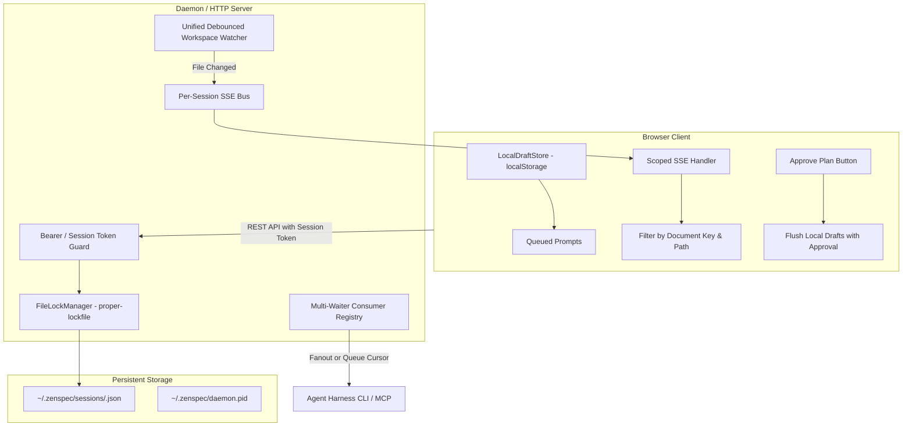

# ZenSpec Architecture & Concurrency Audit: Multi-Agent Workflow Robustness

**Audit Date**: September 22, 2026  
**Target Repository**: [ZenSpec](file:///Users/egand/Developer/projects/zenspec)  
**Target Scope**: Concurrency, Multi-Agent Collaboration, Daemon Lifecycle, State Persistence, SSE Fan-out, and Feedback Resolution  
**Status**: Comprehensive Audit Completed

---

## Executive Summary

ZenSpec was originally conceived as a single-agent, minimalist Agent Experience Interface (AXI) to present Markdown specifications and HTML mockups to human reviewers. As agent workflows evolve into multi-agent systems (where multiple autonomous agents and subagents execute concurrently across projects), ZenSpec experiences severe concurrency hazards, data loss, false-positive plan approvals, and daemon desynchronizations.

This audit evaluates the end-to-end workflow of ZenSpec across six architectural dimensions. We identify **4 Critical**, **5 High**, **4 Medium**, and **2 Low** severity vulnerabilities.

### Key Vulnerability Highlights

1. **Premature False-Positive Approvals via Superseded Poll Ejection (CRITICAL)**:
   When an agent polls a session that is already being polled by another agent or CLI process, the previous waiter receives a `superseded` event. The CLI responds with `process.exit(0)`, leading agent harnesses to assume the plan was approved when no feedback or approval was ever given.
2. **Silent Destruction of Client Annotations on Disk Hot-Reload (CRITICAL)**:
   Reviewer feedback drafts (`queuedPrompts`) reside exclusively in browser client memory until the reviewer clicks "Send Prompts". Whenever an agent edits a file on disk, Server-Sent Events (SSE) trigger a hot reload, which blindly re-initializes client state from server memory, immediately wiping all unsent reviewer annotations.
3. **Workspace-Wide SSE Contamination and Diff Scrambling (CRITICAL)**:
   The workspace file watcher broadcasts reload events across all active session keys without checking whether the modified file matches the session. When multiple browser tabs are open, edits to Document B cause Document A's tab to reload and apply Document B's line diffs, corrupting visual indicators.
4. **Monolithic, Non-Atomic State Persistence & Overwrite Collisions (CRITICAL)**:
   The daemon, CLI commands, and MCP servers maintain separate in-memory caches and write directly to `~/.zenspec/state.json` using synchronous `fs.writeFileSync`. Concurrent writes lead to state truncation, corrupt JSON, and total state loss due to an aggressive fallback reset.
5. **Zombie Daemons and Port Collision Leaks (HIGH)**:
   When port 4388 is busy, the daemon silently falls back to 4389+, while the CLI and helper commands remain hardcoded to port 4388. Furthermore, `/shutdown` closes the HTTP listener without calling `process.exit()`, leaving orphaned Node.js processes in memory.
6. **False-Positive Prompt Resolution Engine (HIGH)**:
   When an agent makes any single modification in a file, fallback heuristics in `resolvePromptsWithDiff` mark every single submitted prompt and question in the document as resolved, even if they are hundreds of lines away or completely unaddressed.
7. **Unauthenticated Public Remote Tunnel (HIGH)**:
   The `--share` command spins up a public Cloudflare tunnel and generates an authentication token in the URL query, but the HTTP server never validates the token on incoming requests.

---

## Vulnerability Severity Matrix

| ID          | Category                | Issue Title                                                        | Severity     | Impact                                                                 |
| :---------- | :---------------------- | :----------------------------------------------------------------- | :----------- | :--------------------------------------------------------------------- |
| **CONC-01** | Multi-Agent Concurrency | Silent Poll Ejection via Supersede Logic Exits with Code 0         | **CRITICAL** | Premature false-positive plan approval in agent harnesses              |
| **CONC-02** | Browser & SSE Sync      | Client Draft Loss on Agent Disk Hot-Reload                         | **CRITICAL** | Reviewer comments and answered questions erased during active editing  |
| **CONC-03** | Browser & SSE Sync      | Cross-Document SSE Reload Contamination & Phantom Diffs            | **CRITICAL** | Visual diff corruption and phantom reloads across tabs                 |
| **CONC-04** | State Persistence       | Non-Atomic `fs.writeFileSync` and Multi-Process State Clobbering   | **CRITICAL** | Silent loss of all session history across all repositories             |
| **DAEM-01** | Daemon Architecture     | Daemon Spawn Race Condition & Port Hopping Process Leaks           | **HIGH**     | Orphaned Node.js background daemons on ports 4389+                     |
| **DAEM-02** | Daemon Architecture     | Hardcoded Port 4388 in CLI Subcommands Breaks Custom Ports         | **HIGH**     | `poll`, `approve`, `reply`, and `end` fail when port is not 4388       |
| **DAEM-03** | Daemon Architecture     | Zombie Daemon on `/shutdown` (`process.exit` Missing)              | **HIGH**     | Daemon process hangs indefinitely after stop command                   |
| **APPR-01** | Approval & Lifecycle    | Over-Eager Auto-Resolution Marks All Feedback Resolved             | **HIGH**     | Reviewer questions marked resolved without agent addressing them       |
| **APPR-02** | Approval & Lifecycle    | Permanent Session Lock: Ended & Approved Sessions Cannot Re-Review | **HIGH**     | Agents cannot initiate a new review cycle on previously approved specs |
| **SEC-01**  | Security & Tunnel       | Token Bypass on Public Cloudflare Quick Tunnel                     | **HIGH**     | Unauthenticated remote access to code specs and approval buttons       |
| **CONC-05** | Multi-Agent Concurrency | Destructive Queue Draining (`takeQueuedPrompts`) Starves Agents    | **MEDIUM**   | Only one agent receives feedback when multiple agents poll             |
| **DAEM-04** | Daemon Architecture     | Global Daemon Scope Leaks State Across Unrelated Repositories      | **MEDIUM**   | `zenspec stop` in Repo A terminates active reviews in Repo B           |
| **BROW-01** | Browser & SSE Sync      | Navigation Snap-Back Trap: Uninitialized Documents Return 404      | **MEDIUM**   | Reviewer cannot inspect workspace files from the sidebar               |
| **APPR-03** | Approval & Lifecycle    | Approval Action Discards Unsubmitted Queue Items                   | **MEDIUM**   | Answers to questions lost if reviewer approves without sending prompts |
| **SEC-02**  | Security & Tunnel       | Unrestricted CORS (`*`) Exposes Local Daemon to Malicious Websites | **LOW**      | Malicious web pages can trigger shutdown or read local specs           |
| **BROW-02** | Browser & SSE Sync      | Missing Browser History `popstate` Support                         | **LOW**      | Browser Back/Forward buttons desynchronize canvas and URL              |

---

## Objective 1: Multi-Agent Concurrency & Session Collisions

### 1.1 Premature False-Positive Approvals via Supersede Logic (CONC-01)

- **Severity**: **CRITICAL**
- **Location**: [src/session-store.ts#L619-L635](file:///Users/egand/Developer/projects/zenspec/src/session-store.ts#L619-L635), [src/cli.ts#L201-L203](file:///Users/egand/Developer/projects/zenspec/src/cli.ts#L201-L203), [src/cli.ts#L463-L465](file:///Users/egand/Developer/projects/zenspec/src/cli.ts#L463-L465)

#### Analysis

In [src/session-store.ts](file:///Users/egand/Developer/projects/zenspec/src/session-store.ts#L619-L635):

```typescript
public registerPollWaiter(key: string, waiter: (res: PollResponse) => void): void {
  const existing = this.pollWaiters.get(key);
  if (existing && existing.length > 0) {
    for (const oldWaiter of existing) {
      try {
        oldWaiter({
          status: PollStatus.Superseded,
          file: this.sessions.get(key)?.filePath || "",
          message: "New poll client connected for this session.",
        });
      } catch (err) {
        void err;
      }
    }
  }
  this.pollWaiters.set(key, [waiter]);
}
```

And in [src/cli.ts](file:///Users/egand/Developer/projects/zenspec/src/cli.ts#L462-L466):

```typescript
const data = JSON.parse(trimmed);
if (data.status === PollStatus.Superseded) {
  process.exit(0);
}
console.log(JSON.stringify(data, null, 2));
```

#### Reproducible Failure Scenario

1. Agent 1 starts reviewing a plan: `zenspec docs/plans/feature.md`. The process runs in the background, long-polling `http://127.0.0.1:4388/api/poll?key=<key>`.
2. Agent 2 (e.g. an autonomous subagent or verification worker) also touches the document or runs `zenspec poll docs/plans/feature.md`.
3. The daemon invokes `oldWaiter({ status: "superseded" })`.
4. Agent 1's CLI process receives the response and executes `process.exit(0)`.
5. The calling agent harness (e.g., Antigravity CLI, Cursor, Windsurf, or Claude) observes that the background task exited with code 0 and has concluded.
6. The agent harness assumes the user approved the plan and commences irreversible code generation and destructive file mutations.

### 1.2 Destructive Queue Draining (`takeQueuedPrompts`) Starves Multi-Agent Collaborators (CONC-05)

- **Severity**: **MEDIUM**
- **Location**: [src/session-store.ts#L644-L666](file:///Users/egand/Developer/projects/zenspec/src/session-store.ts#L644-L666)

#### Analysis

When prompts are retrieved during polling, `takeQueuedPrompts` clears the queue in place:

```typescript
public takeQueuedPrompts(key: string): PromptItem[] {
  const session = this.sessions.get(key);
  if (!session) return [];
  const prompts = [...session.queuedPrompts];
  session.queuedPrompts = [];
  // ...
  this.persistState();
  return prompts;
}
```

If multiple agents or automated verifiers are subscribed to the session, the first consumer to connect drains the entire queue. Any other agent polling at the same moment receives an empty prompt list or hangs indefinitely waiting for a new event.

### 1.3 `sessionKey` Collision and Workspace Root Resolution Across Multi-Repository Daemons

- **Severity**: **HIGH**
- **Location**: [src/session-store.ts#L29-L31](file:///Users/egand/Developer/projects/zenspec/src/session-store.ts#L29-L31), [src/session-store.ts#L250-L255](file:///Users/egand/Developer/projects/zenspec/src/session-store.ts#L250-L255)

#### Analysis

1. `sessionKey` is calculated as `crypto.createHash("sha256").update(canonicalPath).digest("hex").slice(0, 16)`.
   - 16 hex characters provide only 64 bits of collision resistance.
   - The key is derived solely from the local file path. It contains no repository identifier, git remote hash, or workspace ID.
   - If two agents run in containerized environments, devcontainers, or standard CI setups where paths are identical (e.g. `/workspace/docs/plans/spec.md`), both completely collide on the same daemon session.
2. In [src/session-store.ts](file:///Users/egand/Developer/projects/zenspec/src/session-store.ts#L250-L255):
   ```typescript
   if (canonicalPath.startsWith(process.cwd())) {
     workspaceRoot = process.cwd();
   } else {
     workspaceRoot = path.dirname(canonicalPath);
   }
   ```
   The daemon is spawned by whichever agent happened to run first. Its `process.cwd()` is pinned to that first agent's project root (e.g. `/Users/egand/Developer/project-alpha`).
   When a second agent from `/Users/egand/Developer/project-beta` opens a specification, the check `canonicalPath.startsWith(process.cwd())` evaluates to `false`.
   `workspaceRoot` is set to `path.dirname(canonicalPath)` (`.../project-beta/docs/plans`), causing the file explorer in the browser to collapse and hide all root files, `README.md`, and sibling directories.

---

## Objective 2: Daemon Architecture, Port Allocation & Lifecycle

### 2.1 Daemon Spawn Race Condition & Port Hopping Process Leaks (DAEM-01)

- **Severity**: **HIGH**
- **Location**: [src/cli.ts#L57-L82](file:///Users/egand/Developer/projects/zenspec/src/cli.ts#L57-L82), [src/server.ts#L64-L73](file:///Users/egand/Developer/projects/zenspec/src/server.ts#L64-L73)

#### Analysis

In [src/cli.ts](file:///Users/egand/Developer/projects/zenspec/src/cli.ts#L57-L82):

```typescript
async function startServerDaemon(port = DEFAULT_PORT, host = DEFAULT_HOST): Promise<void> {
  const isRunning = await isServerRunning(port, host);
  if (isRunning) return;

  const child = spawn(
    process.execPath,
    [__filename, "server", "--port", String(port), "--host", host],
    {
      detached: true,
      stdio: "ignore",
    },
  );
  child.unref();

  const start = Date.now();
  while (Date.now() - start < 4000) {
    if (await isServerRunning(port, host)) return;
    await new Promise((r) => setTimeout(r, 100));
  }
  throw new Error(`Failed to start zenspec daemon on port ${port}`);
}
```

And in [src/server.ts](file:///Users/egand/Developer/projects/zenspec/src/server.ts#L64-L73):

```typescript
const onError = (err: any) => {
  this.server.removeListener("listening", onListening);
  if (err.code === "EADDRINUSE" && this.port !== 0 && portToTry < this.port + 10) {
    resolve(tryListen(portToTry + 1));
  } else {
    reject(err);
  }
};
```

#### Reproducible Failure Scenario

1. Agent 1 and Agent 2 simultaneously invoke `zenspec <file>` when the daemon is stopped.
2. Both CLI processes check `isServerRunning(4388)`. Both receive `false`.
3. Both processes spawn detached background daemons requesting port 4388.
4. Daemon 1 binds port 4388 successfully.
5. Daemon 2 encounters `EADDRINUSE`. Its `tryListen` logic automatically hops to port 4389 and binds successfully.
6. Both CLI processes poll port 4388. Because Daemon 1 is listening on 4388, both CLI processes assume success.
7. Daemon 2 remains permanently running on port 4389 as an orphaned background process without any CLI or client connected to it.
8. Each concurrent burst spawns more leaked background Node processes (ports 4389, 4390, 4391...).

### 2.2 Hardcoded Port 4388 in CLI Subcommands (DAEM-02)

- **Severity**: **HIGH**
- **Location**: [src/cli.ts#L16-L39](file:///Users/egand/Developer/projects/zenspec/src/cli.ts#L16-L39), [src/cli.ts#L192](file:///Users/egand/Developer/projects/zenspec/src/cli.ts#L192), [src/cli.ts#L454](file:///Users/egand/Developer/projects/zenspec/src/cli.ts#L454)

#### Analysis

[src/cli.ts](file:///Users/egand/Developer/projects/zenspec/src/cli.ts) declares:

```typescript
const DEFAULT_PORT = SERVER_DEFAULTS.PORT; // 4388
const DEFAULT_HOST = SERVER_DEFAULTS.HOST; // 127.0.0.1
```

While `zenspec <file> --port 5000` allows specifying a custom port when opening the reviewer, none of the coordination subcommands support `--port`:

- `zenspec poll <file>` connects unconditionally to `http://127.0.0.1:4388/api/poll`.
- `zenspec approve <file>` posts to `http://127.0.0.1:4388/api/<key>/approve`.
- `zenspec reply <file>` posts to `http://127.0.0.1:4388/api/<key>/reply`.
- `zenspec progress <file>` posts to `http://127.0.0.1:4388/api/<key>/progress`.
- `zenspec stop` posts to `http://127.0.0.1:4388/shutdown`.

If port 4388 is occupied by another application or if a custom port was passed, all agent coordination commands fail immediately with `ECONNREFUSED` or connect to an alien process.

### 2.3 Zombie Daemon on Shutdown (`process.exit` Missing) (DAEM-03)

- **Severity**: **HIGH**
- **Location**: [src/server.ts#L248-L253](file:///Users/egand/Developer/projects/zenspec/src/server.ts#L248-L253), [src/server.ts#L93-L102](file:///Users/egand/Developer/projects/zenspec/src/server.ts#L93-L102)

#### Analysis

When `/shutdown` is called:

```typescript
if (pathname === "/shutdown" && req.method === "POST") {
  res.writeHead(200, { "Content-Type": "application/json" });
  res.end(JSON.stringify({ ok: true, message: "Shutting down" }));
  setTimeout(() => this.stop(), 50);
  return;
}
```

`this.stop()` closes the HTTP server and chokidar file watchers. However, **`process.exit(0)` is never called anywhere in `src/server.ts`**.
If any persistent TCP socket, active SSE connection, pending HTTP keep-alive, or event loop handle remains open, the Node process will not terminate. It continues running in the background as a zombie process indefinitely.

### 2.4 Global Daemon Scope Leaks State Across Unrelated Repositories (DAEM-04)

- **Severity**: **MEDIUM**
- **Location**: [src/cli.ts#L124-L138](file:///Users/egand/Developer/projects/zenspec/src/cli.ts#L124-L138)

#### Analysis

Because ZenSpec runs a single global machine-level daemon on port 4388:

- If Agent A in `repo-game` issues `zenspec stop`, the daemon is killed for Agent B working in `repo-backend`.
- All active SSE connections in Agent B's browser drop.
- Agent B's long-poll fails with `ECONNRESET`.

---

## Objective 3: State Persistence & Data Corruption Risks

### 3.1 Non-Atomic `fs.writeFileSync` and Multi-Process State Clobbering (CONC-04)

- **Severity**: **CRITICAL**
- **Location**: [src/session-store.ts#L220-L231](file:///Users/egand/Developer/projects/zenspec/src/session-store.ts#L220-L231), [src/session-store.ts#L207-L218](file:///Users/egand/Developer/projects/zenspec/src/session-store.ts#L207-L218)

#### Analysis

In [src/session-store.ts](file:///Users/egand/Developer/projects/zenspec/src/session-store.ts):

```typescript
private persistState(): void {
  try {
    this.ensureStateDir();
    const obj: Record<string, SessionState> = {};
    for (const [k, v] of this.sessions.entries()) {
      obj[k] = v;
    }
    fs.writeFileSync(STATE_FILE, JSON.stringify(obj, null, 2), "utf8");
  } catch {
    // Ignore persist errors
  }
}

private loadState(): void {
  if (!fs.existsSync(STATE_FILE)) return;
  try {
    const raw = fs.readFileSync(STATE_FILE, "utf8");
    const data: Record<string, SessionState> = JSON.parse(raw);
    for (const [k, v] of Object.entries(data)) {
      this.sessions.set(k, v);
    }
  } catch {
    // If state is corrupt, start fresh
  }
}
```

#### Catastrophic Failure Mechanism

1. **Non-Atomic File Replacement**:
   `fs.writeFileSync` writes directly to `~/.zenspec/state.json`. If the process is terminated (e.g. CLI exits, user interrupts, or system crashes mid-write), the file is left truncated (0 bytes or partial JSON).
2. **Total State Wipe on Syntax Error**:
   When any process runs `loadState()` on a truncated file, `JSON.parse(raw)` throws a `SyntaxError`. The catch block silently suppresses the error ("If state is corrupt, start fresh") and resets `this.sessions = new Map()`. When `persistState()` is next triggered, it writes an empty object `{}` to disk, permanently deleting the review history, decisions, and approval records of all projects on the machine.
3. **Multi-Process In-Memory Divergence (Last-Write-Wins Overwrite)**:
   The daemon runs its own `SessionStore` in memory. Each CLI invocation (`zenspec <file>`, `zenspec status`, `zenspec adr`, and MCP tool calls) instantiates a _new_ `SessionStore`.
   When CLI Process 1 writes Session A to disk, Daemon has only Session B in its memory. When Daemon receives a presence change or approval, it calls `persistState()`, dumping its in-memory map and completely overwriting `state.json`, destroying Session A.

### 3.2 Unbounded Monolithic State Bloat

- **Severity**: **MEDIUM**
- **Location**: [src/session-store.ts#L264-L266](file:///Users/egand/Developer/projects/zenspec/src/session-store.ts#L264-L266), [src/session-store.ts#L338-L340](file:///Users/egand/Developer/projects/zenspec/src/session-store.ts#L338-L340)

#### Analysis

`SessionState` duplicates and stores complete file contents:

```typescript
session.previousContent = oldContent;
session.currentContent = newContent;
```

For large architectural plans (100KB to 1MB) across dozens of files, `~/.zenspec/state.json` grows to tens of megabytes. Because `persistState()` is called synchronously on every single keystroke, telemetry event, chat message, and file modification, Node.js blocks the main thread serializing and writing the entire multi-megabyte JSON file synchronously.

---

## Objective 4: SSE Event Fan-out & Browser State Sync

### 4.1 Client Draft Loss on Agent Disk Hot-Reload (CONC-02)

- **Severity**: **CRITICAL**
- **Location**: [src/client/app.ts#L98](file:///Users/egand/Developer/projects/zenspec/src/client/app.ts#L98), [src/client/app.ts#L1262-L1273](file:///Users/egand/Developer/projects/zenspec/src/client/app.ts#L1262-L1273)

#### Analysis

In the browser client, reviewer comments, rating selections, and question cards are stored in a local array:

```typescript
let queuedPrompts: PromptItem[] = [];
```

These items are NOT transmitted to the server until the reviewer explicitly clicks "Send Prompts to Agent" (`sendPrompts`).

When an agent edits the file on disk, the server emits `ServerEvent.Reload` over SSE:

```typescript
es.addEventListener(ServerEvent.Reload, (e: MessageEvent) => {
  // ...
  loadDocument(currentFilePath, true);
  showToast("⚡ Hot reloaded: document updated on disk");
});
```

And inside `loadDocument`:

```typescript
queuedPrompts = data.queuedPrompts || [];
```

Because the server's `data.queuedPrompts` is empty (the unsubmitted drafts were only in the browser's memory), **all pending comments, question answers, and text selections in the browser are completely wiped out**.

#### User Experience Impact

A human reviewer spends 10 minutes reading a specification, answering questions, and adding line annotations. While the reviewer is reading Section 3, the agent updates Section 1 based on an earlier note. The agent writes the file. The browser hot reloads, and all of the reviewer's unsubmitted feedback disappears instantly with no undo.

### 4.2 Cross-Document SSE Reload Contamination & Phantom Diffs (CONC-03)

- **Severity**: **CRITICAL**
- **Location**: [src/server.ts#L175-L207](file:///Users/egand/Developer/projects/zenspec/src/server.ts#L175-L207)

#### Analysis

In [src/server.ts](file:///Users/egand/Developer/projects/zenspec/src/server.ts#L175-L207):

```typescript
watcher.on("all", (_event, changedPath) => {
  // ...
  if (fs.existsSync(changedPath)) {
    try {
      const canonicalChanged = fs.realpathSync(changedPath);
      const fileSession = this.store.getSessionByFile(canonicalChanged);
      if (fileSession) {
        const newContent = fs.readFileSync(canonicalChanged, "utf8");
        const diffs = this.store.recordFileUpdate(fileSession.key, newContent);
        this.emitSSE(key, ServerEvent.Reload, {
          file: canonicalChanged,
          relPath: path.relative(workspaceRoot, canonicalChanged),
          timestamp: Date.now(),
          diffs,
        });
      }
    } catch {
      // Ignore
    }
  }
});
```

`watchWorkspace(key, workspaceRoot)` is initialized per connected SSE client. In the watcher callback:

- When any file in the workspace changes (e.g. `spec-B.md`), `this.emitSSE(key, ServerEvent.Reload, ...)` sends the reload event to `key` (which is `spec-A.md`'s session!).
- In Tab A (reviewing `spec-A.md`), the client receives `ServerEvent.Reload` with `data.diffs` from `spec-B.md`.
- Tab A executes `loadDocument(currentFilePath, true)` and applies `spec-B.md` diff line numbers to `spec-A.md`.
- Diff highlighting is scrambled with phantom green/red lines on lines that were never changed in `spec-A.md`.

### 4.3 Redundant Duplicate Watchers Over the Same Workspace Tree

- **Severity**: **HIGH**
- **Location**: [src/server.ts#L141-L144](file:///Users/egand/Developer/projects/zenspec/src/server.ts#L141-L144)

#### Analysis

`wsWatchKey` is keyed as `ws:${key}`. When 5 tabs open for different documents in the same workspace, 5 separate recursive chokidar instances watch the exact same directory.
When any single file changes, all 5 watchers fire simultaneously.

1. Watcher 1 calls `recordFileUpdate(fileSession.key, newContent)` and computes valid diffs.
2. Watchers 2, 3, 4, and 5 call `recordFileUpdate` immediately afterwards. Because `session.currentContent` was already updated to `newContent` by Watcher 1, `computeLineDiff(newContent, newContent)` returns `[]`.
3. The subsequent watchers overwrite `session.diffs` with `[]` and emit empty diffs to the client, causing diff highlights to flicker and vanish from the reviewer's screen.

### 4.4 Navigation Snap-Back Trap on Uninitialized Documents (BROW-01)

- **Severity**: **MEDIUM**
- **Location**: [src/server.ts#L413-L417](file:///Users/egand/Developer/projects/zenspec/src/server.ts#L413-L417), [src/client/app.ts#L78-L81](file:///Users/egand/Developer/projects/zenspec/src/client/app.ts#L78-L81), [src/client/app.ts#L1380-L1419](file:///Users/egand/Developer/projects/zenspec/src/client/app.ts#L1380-L1419)

#### Analysis

When the reviewer clicks an unreviewed document in the sidebar file explorer:

1. `switchDocument` sets `sessionKey = targetKey` and fetches `/api/${sessionKey}/document`.
2. Because no agent has run `zenspec` on that file, `this.store.getSession(targetKey)` returns `undefined`.
3. The server responds with `404 Session not found`.
4. The client's 404 handler triggers `autoRecoverSession()`, which queries `/api/workspace` and finds the original file session.
5. The client resets `sessionKey` back to the original session and loads the original document.
6. The user is trapped: clicking any file in the workspace file tree snaps back to the active document.

---

## Objective 5: Approval & Feedback Resolution Pitfalls

### 5.1 Over-Eager Auto-Resolution Marks All Feedback Resolved (APPR-01)

- **Severity**: **HIGH**
- **Location**: [src/session-store.ts#L475-L538](file:///Users/egand/Developer/projects/zenspec/src/session-store.ts#L475-L538)

#### Analysis

In [src/session-store.ts](file:///Users/egand/Developer/projects/zenspec/src/session-store.ts#L475-L538):

```typescript
public resolvePromptsWithDiff(key: string, diffs: DiffRange[]): void {
  // ...
  for (const p of submitted) {
    let matchedDiff: DiffRange | undefined;
    const mdTarget = p.target?.type === TargetType.MarkdownRange ? p.target : undefined;

    if (mdTarget && mdTarget.startLine) {
      // 1. Direct overlap
      matchedDiff = diffs.find(...);

      // 2. Fallback: closest distance in old coordinates
      if (!matchedDiff) {
        let minDistance = Infinity;
        for (const d of diffs) {
          const dist = Math.abs(d.oldStartLine - targetOld);
          if (dist < minDistance) {
            minDistance = dist;
            matchedDiff = d;
          }
        }
      }
    }

    // 3. Fallback: Pick primary substantive diff
    if (!matchedDiff) {
      matchedDiff = candidates[0];
    }

    p.status = "resolved";
    p.resolvedAt = new Date().toISOString();
    p.resolution = {
      startLine: matchedDiff.startLine,
      endLine: matchedDiff.endLine,
      diffSummary: matchedDiff.newText?.slice(0, 150),
    };
  }
}
```

#### Reproducible Failure Scenario

1. Reviewer submits two items:
   - Item A: An annotation on line 15 asking to change the authentication provider.
   - Item B: A question on line 420 asking whether to use Redis or PostgreSQL.
2. The agent edits lines 15-18 to update the authentication provider.
3. The server computes diffs: only lines 15-18 changed.
4. Item A matches directly and is marked `resolved`.
5. Item B does not match. It enters Fallback 2 ("closest distance"). Because the edit at line 15 is the only diff in the file, `minDistance` matches line 15!
6. Item B is marked `status: "resolved"`, with jump coordinates pointing to line 15!
7. The reviewer sees Question B moved to the "Resolved" tab, assuming the agent answered it, when line 420 was never touched.

### 5.2 Permanent Session Lock: Ended & Approved Sessions Cannot Re-Review (APPR-02)

- **Severity**: **HIGH**
- **Location**: [src/session-store.ts#L289-L301](file:///Users/egand/Developer/projects/zenspec/src/session-store.ts#L289-L301), [src/cli.ts#L192-L207](file:///Users/egand/Developer/projects/zenspec/src/cli.ts#L192-L207), [src/mcp.ts#L263-L285](file:///Users/egand/Developer/projects/zenspec/src/mcp.ts#L263-L285)

#### Analysis

In [src/session-store.ts](file:///Users/egand/Developer/projects/zenspec/src/session-store.ts#L289-L301):

```typescript
} else {
  session.filePath = targetFile;
  session.canonicalPath = canonicalPath;
  session.docType = docType;
  session.workspaceRoot = workspaceRoot;
  if (!session.promptHistory) session.promptHistory = [];
  if (session.approved === undefined) session.approved = false;
  // NOTE: session.ended is NEVER reset to false!
  // NOTE: session.approved is NEVER reset to false!
}
```

When a review session completes (`session.ended = true` or `session.approved = true`), that state is permanently persisted in `~/.zenspec/state.json`.

If an agent or human later invokes `zenspec <file>` to review a new iteration of that specification:

- **CLI Mode**: `/api/poll` observes `session.ended === true` and returns `status: "ended"`. The CLI exits immediately. The reviewer cannot interact with the document.
- **MCP Mode (`zen_open_review`)**: The tool checks `if (session.approved)` and immediately returns `status: "approved"` to the LLM agent without ever opening the browser or waiting for review!

There is no review cycle counter, session iteration ID, or reset flag.

### 5.3 Approval Action Discards Unsubmitted Queue Items (APPR-03)

- **Severity**: **MEDIUM**
- **Location**: [src/client/app.ts#L2031-L2056](file:///Users/egand/Developer/projects/zenspec/src/client/app.ts#L2031-L2056)

#### Analysis

In [src/client/app.ts](file:///Users/egand/Developer/projects/zenspec/src/client/app.ts#L2031-L2056):

```typescript
document.getElementById("zen-approve-btn")?.addEventListener("click", async () => {
  let res = await fetch(`/api/${sessionKey}/approve`, {
    method: "POST",
    headers: { "Content-Type": "application/json" },
    body: JSON.stringify({ notes: "Explicitly approved from ZenSpec UI" }),
  });
  // ...
});
```

When the reviewer clicks "Approve Plan", only the approval note is sent. If the reviewer answered question cards or typed annotations without clicking "Send Prompts to Agent" first, those items are never sent to the server. The plan is marked approved, the agent proceeds, and the reviewer's decisions are discarded.

---

## Bonus: Security & Tunnel Vulnerabilities

### 6.1 Token Bypass on Public Cloudflare Quick Tunnel (SEC-01)

- **Severity**: **HIGH**
- **Location**: [src/tunnel.ts#L26-L78](file:///Users/egand/Developer/projects/zenspec/src/tunnel.ts#L26-L78), [src/server.ts#L225-L255](file:///Users/egand/Developer/projects/zenspec/src/server.ts#L225-L255)

#### Analysis

When running `zenspec <file> --share`:

1. `startTunnel` spawns `cloudflared tunnel --url http://127.0.0.1:4388`.
2. It prints a public URL: `https://<random-id>.trycloudflare.com?token=<token>`.
3. However, **`src/server.ts` has zero middleware or checks inspecting `req.headers.authorization` or `?token=`**.
4. Anyone on the internet who discovers or scans the public Cloudflare subdomain can access all documents, read full source files, submit prompts, trigger approvals, and shut down the daemon via POST `/shutdown`.

### 6.2 Permissive Cross-Origin Access (`CORS: *`) (SEC-02)

- **Severity**: **LOW**
- **Location**: [src/server.ts#L227-L230](file:///Users/egand/Developer/projects/zenspec/src/server.ts#L227-L230)

#### Analysis

`server.ts` sets `Access-Control-Allow-Origin: *` for all endpoints. Any arbitrary website loaded in the reviewer's web browser can perform `fetch("http://127.0.0.1:4388/api/workspace")` to exfiltrate private codebases or call `/shutdown` to terminate the user's review session.

---

## Actionable Refactoring & Architectural Recommendations

To make ZenSpec completely reliable for concurrent multi-agent systems, the following architectural refactoring is required.



---

### Recommendation 1: Project-Scoped / Repository-Scoped Daemons with PID Registry

Instead of a single global machine-level daemon on a hardcoded port:

1. **Dynamic Port Allocation with Port Registry**:
   Store the active daemon address in `.zenspec/daemon.json` (inside the git repository root or project root) containing:
   ```json
   {
     "pid": 48210,
     "port": 4388,
     "host": "127.0.0.1",
     "token": "4a7f9c2d...",
     "workspaceRoot": "/Users/egand/Developer/projects/zenspec",
     "startedAt": 1774378192000
   }
   ```
2. **CLI Auto-Discovery**:
   Every CLI command (`poll`, `approve`, `reply`, `status`, `stop`) reads `.zenspec/daemon.json` from the nearest parent directory. It connects to the exact port recorded for that specific repository.
3. **Flock-Guarded Daemon Startup**:
   Use `proper-lockfile` or atomic `O_EXCL` file locks on `.zenspec/daemon.lock` during daemon launch. If a spawn race occurs, the second process waits for the lock, reads the registered port, and connects rather than spawning a rogue daemon.
4. **Clean Exit Handlers**:
   In `server.ts`, `/shutdown` must forcefully terminate open keep-alive connections and explicitly invoke `process.exit(0)`.

---

### Recommendation 2: Partitioned, Atomic State Persistence

Replace monolithic `~/.zenspec/state.json`:

1. **Per-Session File Partitioning**:
   Store each session in an independent file: `~/.zenspec/sessions/<sessionKey>.json`. Mutations to Document A never write to or lock Document B's file.
2. **Atomic Write-Replace Pattern**:
   Always write to a temporary file in the same directory (`~/.zenspec/sessions/<key>.json.tmp.<pid>`) and call `fs.renameSync(tempFile, targetFile)`. In POSIX systems, `rename` is an atomic filesystem operation that prevents partial JSON corruption.
3. **Strip Document Body from State**:
   Never store full file text (`previousContent`, `currentContent`) inside the JSON state. Compute diffs on the fly by reading the target file and git index, or store diffs only. Keep the state file small (<5KB).

---

### Recommendation 3: Non-Destructive Multi-Consumer Polling & Event Delivery

1. **Remove Supersede Auto-Exit**:
   Never exit with code 0 on `superseded`. If a poll waiter is superseded, return HTTP 409 or hold both waiters in a subscription list.
2. **Message Acknowledgment / Event Cursors**:
   Assign an incremental `seq` number to every prompt item. Polling clients query `/api/poll?key=<key>&since=<seq>`.
   - The queue is not wiped out on read.
   - Any number of agents or subagents can poll concurrently without starving each other.
   - Only an explicit agent acknowledgment (`/api/:key/ack?ids=...`) marks prompts as delivered.

---

### Recommendation 4: Client-Side Draft Auto-Save & Hot-Reload Preservation

1. **LocalStorage Draft Backup**:
   Save `queuedPrompts` to `localStorage.getItem('zenspec_draft_' + sessionKey)` on every input or selection change.
2. **Hot-Reload Draft Merging**:
   When `ServerEvent.Reload` fires, `loadDocument` must preserve `queuedPrompts`. Merge local in-memory drafts with newly fetched server items by prompt ID.
3. **Flush on Approve**:
   When the user clicks "Approve Plan", automatically package any unsubmitted `queuedPrompts` into the approval POST payload so no annotations or answers are lost.

---

### Recommendation 5: Scoped SSE Event Routing & Watcher Unification

1. **One Workspace Watcher per Daemon**:
   The daemon should maintain a single workspace watcher for the project root, rather than spawning a new recursive watcher for every opened tab.
2. **Strict Event Filtering**:
   When a file changes, the server must emit `ServerEvent.Reload` containing `{ key: fileSession.key, canonicalPath }`. The browser client must verify:
   ```typescript
   if (data.key !== sessionKey && data.file !== currentFilePath) {
     return; // Ignore reloads belonging to other documents
   }
   ```

---

### Recommendation 6: Strict Proximity Bounds for Feedback Resolution

In `SessionStore.resolvePromptsWithDiff`:

1. Delete Fallback 2 ("closest distance across entire document") and Fallback 3 ("candidates[0]").
2. A prompt targeting lines `[startLine, endLine]` may ONLY be resolved if a diff directly intersects `[startLine - 3, endLine + 3]`.
3. If no matching diff exists, the prompt remains `submitted` (pending review).
4. Chat prompts without line targets must only be resolved via explicit agent reply (`/api/:key/reply`) or interactive reviewer dismissal in the UI.

---

### Recommendation 7: Session Review Cycles and Re-Review Flags

1. Add an integer `cycle: number` to `SessionState`.
2. When an agent opens an approved or ended session with new file modifications:
   - Increment `session.cycle`.
   - Reset `session.approved = false`.
   - Reset `session.ended = false`.
   - Archive previous prompts into `session.cycleHistory[cycle - 1]`.
3. This allows multi-step iterative workflows where an agent refactors code, generates an updated specification, and requests fresh approval.

---

### Recommendation 8: Security Token & CORS Lockdown

1. **Session Bearer Authentication**:
   When a session is created, generate a cryptographically secure token (`crypto.randomBytes(24).toString("hex")`).
   Enforce token validation on all mutating routes (`/api/*`, `/shutdown`, `/events/*`) via `Authorization: Bearer <token>` or `?token=<token>`.
2. **CORS Restriction**:
   Restrict CORS headers to `localhost` and `127.0.0.1` origins, rejecting arbitrary third-party browser origins.

---

## Conclusion

ZenSpec's core interactive interface (Markdown sourcemapping, Mermaid zooming, KaTeX formulas, and resilient question callouts) provides an outstanding human-in-the-loop experience. However, its background daemon, concurrency coordination, and persistence layer currently rely on single-process, single-agent assumptions.

Applying the recommendations above will transform ZenSpec into a rock-solid, multi-agent-ready coordination layer that prevents data loss, eliminates false-positive approvals, and scales seamlessly across concurrent agent swarms.
